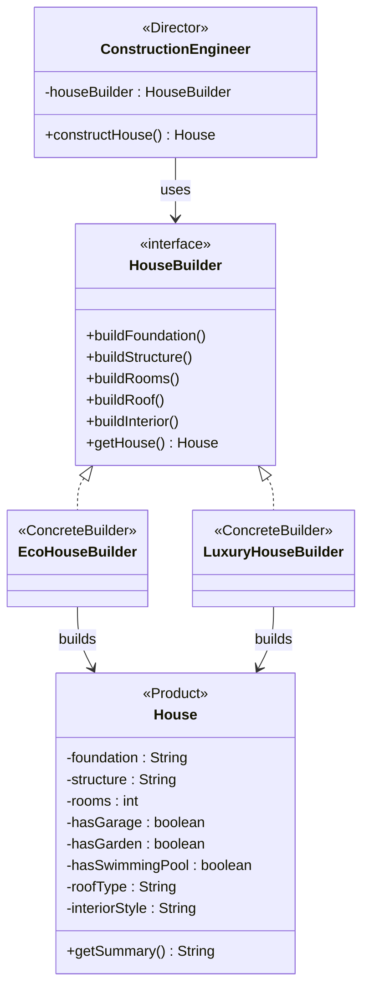
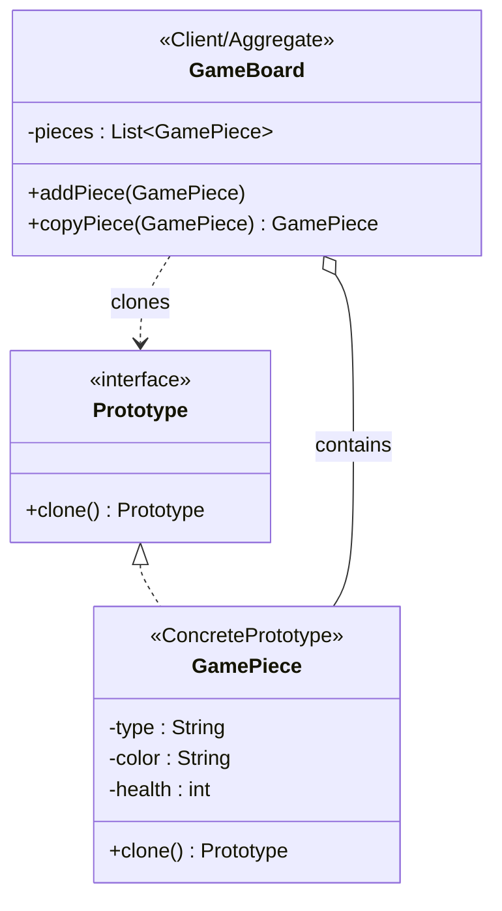

# Design Patterns Implementation in Java

This project demonstrates the implementation of **fundamental design patterns** in Java, showcasing both the problems they solve and their practical applications. Each pattern includes comparison implementations to highlight the benefits of using design patterns.

## 📁 Project Structure

```
src/
├── behavioural/                    # Behavioral Design Patterns
│   ├── command/                    # Command Pattern Implementation
│   │   ├── smartHome/              # Smart Home Automation Example
│   │   └── banking/                # Banking Transaction System Example
│   ├── iterator/                   # Iterator Pattern Implementation
│   │   ├── book/                   # Simple book collection example
│   │   └── notificationmanagement/ # Comprehensive notification system
│   ├── mediator/                   # Mediator Pattern Implementation
│   ├── memento/                    # Memento Pattern Implementation
│   ├── observer/                   # Observer Pattern Implementation  
│   ├── state/                      # State Pattern Implementation
│   ├── strategy/                   # Strategy Pattern Implementation
│   └── template/                   # Template Method Pattern Implementation
├── creational/                     # Creational Design Patterns
│   ├── abstractfactorypattern/     # Abstract Factory Pattern Implementation
│   │   ├── problem/                # Implementation without the pattern
│   │   └── solution/               # Refactored with Abstract Factory
│   ├── factorymethod/              # Factory Method Pattern Implementation
│   │   └── LogisticsApp.java       # Logistics example for Factory Method
│   ├── singleton/                  # Singleton Pattern Implementation
│   │   ├── logger/                 # Thread-safe Logger System
│   │   ├── AppSetting.java         # Application Configuration Singleton
│   │   └── WithOutSingletonPattern.java # Demonstrates singleton usage
│   ├── builder/                    # Builder Pattern Implementation
│   └── prototype/                  # Prototype Pattern Implementation
└── Main.java                       # Main entry point
```

## 🎯 **Design Pattern Categories**

Design patterns are categorized into three main types based on their purpose:

### 🎭 **Behavioral Patterns** (Current Implementation)
**Focus:** Communication between objects and the assignment of responsibilities
- Define how objects interact and communicate with each other
- Concerned with algorithms and assignment of responsibilities between objects
- Help in defining the communication patterns between objects

### 🏭 **Creational Patterns** (Current Implementation)
**Focus:** Object creation mechanisms
- Deal with object creation in a manner suitable to the situation
- Provide flexibility in deciding which objects need to be created for a given use case
- Make the system independent of how its objects are created, composed, and represented

### 🏗️ **Structural Patterns** (Future Consideration)
**Focus:** Object composition and relationships
- Deal with object composition to form larger structures
- Describe ways to compose objects to realize new functionality
- Help ensure that when one part changes, the entire structure doesn't need to change

---

## 🏭 **Creational Design Patterns Overview**

**Creational patterns** provide various object creation mechanisms, which increase flexibility and reuse of existing code. They help make a system independent of how its objects are created, composed, and represented.

### 🎯 **Core Characteristics of Creational Patterns:**

- **Hiding Creation Logic**: They encapsulate the knowledge of which concrete classes the system uses.
- **Flexibility**: The system becomes more flexible in what gets created, who creates it, and how it gets created.
- **Reusability**: They promote reusing code by defining a way to create objects.

### 🎪 **Types of Creational Patterns Implemented:**

#### **1. Singleton Pattern** 👑

**Location:** `src/creational/singleton/`

**Core Purpose:** Ensures a class has only one instance and provides a global point of access to it.

- **Use Cases:** Logging, driver objects, caching, and thread pools.
- **Implementation:** Involves a private constructor, a static field containing its only instance, and a static factory method for obtaining the instance.

#### **2. Abstract Factory Pattern** 🏗️

**Location:** `src/creational/abstractfactorypattern/`

**Core Purpose:** Provides an interface for creating **families of related or dependent objects** without specifying their concrete classes.

- **Problem Solved:** Imagine creating UI elements for different operating systems (Windows, macOS). You need to ensure that a `WindowsButton` is always used with a `WindowsScrollBar`. An Abstract Factory (`WindowsFactory`) guarantees that all created components belong to the same family.

- **Key Components:**
  - **AbstractFactory:** Declares an interface for operations that create abstract product objects.
  - **ConcreteFactory:** Implements the operations to create concrete product objects.
  - **AbstractProduct:** Declares an interface for a type of product object.
  - **ConcreteProduct:** Defines a product object to be created by the corresponding concrete factory.

- **Code Example (`solution/Application.java`):**
  ```java
  // Abstract Factory
  interface UiFactory {
      Button createButton();
      Scrollbar createScrollBar();
  }

  // Concrete Factory for Windows
  class WindowUiFactory implements UiFactory {
      public Button createButton() { return new WindowButton(); }
      public Scrollbar createScrollBar() { return new WindowScrollBar(); }
  }

  // Client Code
  public class Application {
      private Button button;
      private Scrollbar scrollBar;

      public Application(UiFactory factory) {
          button = factory.createButton();
          scrollBar = factory.createScrollBar();
      }
      // ...
  }
  ```

#### **3. Factory Method Pattern** 🏭

**Location:** `src/creational/factorymethod/`

**Core Purpose:** Defines an interface for creating a **single object**, but lets subclasses decide which class to instantiate. It lets a class defer instantiation to subclasses.

- **Problem Solved:** Consider a logistics application. The main `Logistics` class plans a delivery but doesn't know if it will be by truck or ship. Subclasses like `RoadLogistics` and `SeaLogistics` decide which specific transport object to create.

- **Key Components:**
  - **Product:** Defines the interface of objects the factory method creates.
  - **ConcreteProduct:** Implements the Product interface.
  - **Creator:** Declares the factory method, which returns an object of type Product.
  - **ConcreteCreator:** Overrides the factory method to return an instance of a ConcreteProduct.

- **Code Example (`LogisticsApp.java`):**
  ```java
  // Creator
  abstract class Logistics {
      // The factory method
      public abstract Transport createTransport();

      public void planDelivery() {
          Transport transport = createTransport();
          transport.deliver();
      }
  }

  // Concrete Creator
  class RoadLogistics extends Logistics {
      public Transport createTransport() {
          return new Truck();
      }
  }

  // Client Code
  Logistics logistics = new RoadLogistics();
  logistics.planDelivery(); // Uses a Truck
  ```

#### **4. Builder Pattern** 🔨

**Location:** `src/creational/builder/`

**Core Purpose:** Separate the construction of a complex object from its representation so the same construction process can create different representations.

- **Problem Solved:** When creating objects with many optional parameters or complex assembly steps, constructors become unwieldy and error-prone. Builder provides step-by-step construction and readable, flexible configuration.
- **Key Components:** `Product` (e.g., `House`), `Builder` interface (`HouseBuilder`), `ConcreteBuilders` (`EcoHouseBuilder`, `LuxuryHouseBuilder`), `Director` (`ConstructionEngineer`).
- **Demo:** `BuilderDemo.java` builds multiple house variants and shows a fluent builder alternative via `House.Builder`.

```java
// Director orchestrates steps
ConstructionEngineer engineer = new ConstructionEngineer(new LuxuryHouseBuilder());
House house = engineer.constructHouse();
System.out.println(house);

// Fluent builder alternative
House custom = new House.Builder().rooms(4).garage(true).roof("Hip Roof").build();
```

##### Builder – Class Diagram (Mermaid)



#### **5. Prototype Pattern** 🧬

**Location:** `src/creational/prototype/`

**Core Purpose:** Create new objects by cloning existing ones (prototypes), which is useful when object creation is costly or complex.

- **Structure:** Contains both `problem/` (without pattern) and `solutions/` (with `Prototype` interface, `GamePiece`, `GameBoard`, and `GameClientWithPrototype`).
- **Benefit:** Avoids subclass explosion for similar objects; enables fast duplication of configured instances.

##### Prototype – Class Diagram (Mermaid)



---

## 🎯 **Behavioral Design Patterns Overview**

Behavioral patterns are design patterns that identify common communication patterns between objects and realize these patterns. These patterns increase flexibility in carrying out communication by characterizing the ways in which classes or objects interact and distribute responsibility.

### 🎯 **Core Characteristics of Behavioral Patterns:**

#### **1. Communication Focus** 📡
- **Inter-object Communication:** Define how objects talk to each other
- **Message Passing:** Establish protocols for object interaction
- **Event Handling:** Manage how objects respond to events and state changes
- **Notification Systems:** Implement observer-subscriber relationships

#### **2. Responsibility Distribution** ⚖️
- **Role Assignment:** Clearly define what each object is responsible for
- **Separation of Concerns:** Divide complex behaviors into manageable parts
- **Delegation:** Allow objects to delegate tasks to appropriate handlers
- **Chain of Responsibility:** Pass requests through a chain of potential handlers

#### **3. Algorithm Encapsulation** 🔒
- **Strategy Encapsulation:** Wrap algorithms in interchangeable objects
- **Template Definition:** Define algorithm skeletons with customizable steps
- **Command Encapsulation:** Package requests as objects for flexibility
- **State Management:** Encapsulate state-specific behavior in separate objects

#### **4. Flexibility and Extensibility** 🔄
- **Runtime Behavior Changes:** Modify object behavior during execution
- **Loose Coupling:** Reduce dependencies between communicating objects
- **Open/Closed Principle:** Open for extension, closed for modification
- **Dynamic Composition:** Compose behaviors at runtime

### 🎪 **Types of Behavioral Patterns Implemented:**

#### **A. Object Behavioral Patterns** 🎯
Use object composition to distribute behavior among objects:

- **🎮 Command Pattern:** Encapsulate requests as objects
- **👁️ Observer Pattern:** Define one-to-many dependencies between objects
- **🎯 Strategy Pattern:** Define family of algorithms and make them interchangeable
- **🔍 Iterator Pattern:** Provide sequential access to elements of an aggregate
- **💾 Memento Pattern:** Capture and restore object state without violating encapsulation

#### **B. Class Behavioral Patterns** 📋
Use inheritance to distribute behavior between classes:

- **📋 Template Method Pattern:** Define algorithm skeleton, let subclasses override specific steps

### 🌟 **Benefits of Behavioral Patterns:**

#### **1. Enhanced Communication** 📞
```java
// Before: Tight coupling
class WeatherStation {
    private Display display;
    private MobileApp app;
    
    public void updateTemperature(float temp) {
        display.update(temp);  // Direct coupling
        app.notify(temp);      // Hard to extend
    }
}

// After: Observer Pattern - Loose coupling
class WeatherStation implements Subject {
    private List<Observer> observers = new ArrayList<>();
    
    public void updateTemperature(float temp) {
        notifyObservers(temp);  // Flexible, extensible
    }
}
```

#### **2. Flexible Algorithm Selection** 🎛️
```java
// Before: Rigid algorithm selection
class PaymentProcessor {
    public void processPayment(String type, double amount) {
        if (type.equals("credit")) {
            // Credit card logic
        } else if (type.equals("debit")) {
            // Debit card logic
        }
        // Hard to add new payment methods
    }
}

// After: Strategy Pattern - Dynamic algorithm selection
class PaymentProcessor {
    private PaymentStrategy strategy;
    
    public void setStrategy(PaymentStrategy strategy) {
        this.strategy = strategy;
    }
    
    public void processPayment(double amount) {
        strategy.processPayment(amount);  // Flexible, extensible
    }
}
```

#### **3. Undo/Redo Capabilities** ↩️
```java
// Command Pattern enables powerful undo/redo systems
class TextEditor {
    private Stack<Command> history = new Stack<>();
    
    public void executeCommand(Command command) {
        command.execute();
        history.push(command);
    }
    
    public void undo() {
        if (!history.isEmpty()) {
            Command command = history.pop();
            command.undo();  // Powerful undo capability
        }
    }
}
```

### 🎯 **When to Use Behavioral Patterns:**

#### **✅ Use Behavioral Patterns When:**
- Multiple objects need to communicate efficiently
- You need to change object behavior at runtime
- Algorithms need to be interchangeable
- You want to implement undo/redo functionality
- Complex workflows need to be managed
- Event-driven architectures are required
- You need to iterate over collections uniformly

#### **❌ Avoid Behavioral Patterns When:**
- Simple direct method calls are sufficient
- Object interactions are minimal and unlikely to change
- Performance overhead is critical
- The system is small and unlikely to grow

### 🏭 **Creational Design Patterns Summary**

This project implements multiple **Creational Design Patterns** that focus on object creation mechanisms:

- ✅ Factory Method (`src/creational/factorymethod/`)
- ✅ Abstract Factory (`src/creational/abstractfactorypattern/`)
- ✅ Singleton (`src/creational/singleton/`)
- ✅ Builder (`src/creational/builder/`)
- ✅ Prototype (`src/creational/prototype/`)

#### **🔄 Parallel Structure Design:**

The project maintains parallel organization between Behavioral and Creational patterns:

```
Behavioral Patterns (Current)     →     Creational Patterns (Current)
├── Command (Actions)            →     ├── Factory Method (Object Creation)
├── Observer (Notifications)     →     ├── Builder (Complex Construction)
├── Strategy (Algorithms)        →     ├── Singleton (Instance Control)
├── Iterator (Collection Access) →     ├── Prototype (Object Cloning)
├── Memento (State Management)   →     ├── Abstract Factory (Family Creation)
└── Template Method (Workflows)  →     └── [Additional patterns as needed]
```

#### **🎯 Integration Opportunities:**

These patterns can be combined for powerful designs:
- **Factory + Strategy:** Create strategy objects dynamically
- **Builder + Command:** Build complex command objects
- **Singleton + Observer:** Global event management systems
- **Prototype + Memento:** Efficient state cloning and restoration

---

### 2. Observer Pattern 👁️

**Location:** `src/behavioural/observer/`

**Core Purpose:** Defines a one-to-many dependency between objects so that when one object changes state, all dependents are notified automatically.

#### Key Components:
- **Subject Interface:** Attach, detach, notify observers
- **Observer Interface:** Update method for notifications
- **Concrete Subject:** Maintains state and observer list
- **Concrete Observers:** React to state changes

#### Real-World Use Cases:
- **GUI Applications:** Model-View architectures (MVC, MVP, MVVM)
- **Event Systems:** DOM events, custom event handlers
- **Stock Market:** Price change notifications
- **Social Media:** Notification systems for followers

#### 📈 **Real-World Example 1: Stock Market Trading System**

```java
// Observer Interface
interface StockObserver {
    void update(String stockSymbol, double price, double change);
    String getObserverName();
}

// Subject Interface
interface StockSubject {
    void addObserver(StockObserver observer);
    void removeObserver(StockObserver observer);
    void notifyObservers();
}

// Concrete Subject - Stock
class Stock implements StockSubject {
    private String symbol;
    private double price;
    private double previousPrice;
    private List<StockObserver> observers = new ArrayList<>();
    
    public Stock(String symbol, double initialPrice) {
        this.symbol = symbol;
        this.price = initialPrice;
        this.previousPrice = initialPrice;
    }
    
    public void setPrice(double newPrice) {
        this.previousPrice = this.price;
        this.price = newPrice;
        System.out.println("📊 " + symbol + " price updated: $" + price);
        notifyObservers();
    }
    
    public void addObserver(StockObserver observer) {
        observers.add(observer);
        System.out.println("➕ " + observer.getObserverName() + " subscribed to " + symbol);
    }
    
    public void removeObserver(StockObserver observer) {
        observers.remove(observer);
        System.out.println("➖ " + observer.getObserverName() + " unsubscribed from " + symbol);
    }
    
    public void notifyObservers() {
        double change = price - previousPrice;
        for (StockObserver observer : observers) {
            observer.update(symbol, price, change);
        }
    }
    
    public String getSymbol() { return symbol; }
    public double getPrice() { return price; }
}

// Concrete Observers
class TradingBot implements StockObserver {
    private String botName;
    private double buyThreshold;
    private double sellThreshold;
    
    public TradingBot(String name, double buyThreshold, double sellThreshold) {
        this.botName = name;
        this.buyThreshold = buyThreshold;
        this.sellThreshold = sellThreshold;
    }
    
    public void update(String stockSymbol, double price, double change) {
        System.out.println("🤖 " + botName + " received update: " + stockSymbol + 
                         " = $" + price + " (change: " + String.format("%.2f", change) + ")");
        
        if (change <= -buyThreshold) {
            System.out.println("🤖 " + botName + " DECISION: BUY " + stockSymbol + 
                             " (price dropped by $" + Math.abs(change) + ")");
        } else if (change >= sellThreshold) {
            System.out.println("🤖 " + botName + " DECISION: SELL " + stockSymbol + 
                             " (price increased by $" + change + ")");
        }
    }
    
    public String getObserverName() { return botName; }
}

class PortfolioTracker implements StockObserver {
    private String portfolioName;
    private Map<String, Integer> holdings = new HashMap<>();
    
    public PortfolioTracker(String name) {
        this.portfolioName = name;
    }
    
    public void addHolding(String symbol, int shares) {
        holdings.put(symbol, shares);
    }
    
    public void update(String stockSymbol, double price, double change) {
        if (holdings.containsKey(stockSymbol)) {
            int shares = holdings.get(stockSymbol);
            double totalValue = shares * price;
            double totalChange = shares * change;
            
            System.out.println("📊 " + portfolioName + " Portfolio Update:");
            System.out.println("   " + stockSymbol + ": " + shares + " shares @ $" + price + 
                             " = $" + String.format("%.2f", totalValue));
            System.out.println("   Change: " + (change >= 0 ? "+" : "") + 
                             String.format("%.2f", totalChange));
        }
    }
    
    public String getObserverName() { return portfolioName + " Portfolio"; }
}

class PriceAlertSystem implements StockObserver {
    private String alertName;
    private Map<String, Double> priceAlerts = new HashMap<>();
    
    public PriceAlertSystem(String name) {
        this.alertName = name;
    }
    
    public void setPriceAlert(String symbol, double targetPrice) {
        priceAlerts.put(symbol, targetPrice);
        System.out.println("🔔 Alert set: " + symbol + " @ $" + targetPrice);
    }
    
    public void update(String stockSymbol, double price, double change) {
        if (priceAlerts.containsKey(stockSymbol)) {
            double targetPrice = priceAlerts.get(stockSymbol);
            if ((change > 0 && price >= targetPrice) || (change < 0 && price <= targetPrice)) {
                System.out.println("🚨 PRICE ALERT: " + stockSymbol + 
                                 " reached target price $" + targetPrice + 
                                 " (current: $" + price + ")");
                priceAlerts.remove(stockSymbol); // Remove triggered alert
            }
        }
    }
    
    public String getObserverName() { return alertName; }
}

// Usage Example
public class StockMarketExample {
    public static void main(String[] args) {
        // Create stocks
        Stock appleStock = new Stock("AAPL", 150.00);
        Stock googleStock = new Stock("GOOGL", 2800.00);
        
        // Create observers
        TradingBot dayTrader = new TradingBot("DayTrader Bot", 2.0, 3.0);
        TradingBot swingTrader = new TradingBot("Swing Trader", 5.0, 8.0);
        PortfolioTracker myPortfolio = new PortfolioTracker("John's");
        PriceAlertSystem alertSystem = new PriceAlertSystem("Mobile App");
        
        // Setup portfolio
        myPortfolio.addHolding("AAPL", 100);
        myPortfolio.addHolding("GOOGL", 10);
        
        // Setup alerts
        alertSystem.setPriceAlert("AAPL", 155.0);
        alertSystem.setPriceAlert("GOOGL", 2750.0);
        
        // Subscribe observers to stocks
        appleStock.addObserver(dayTrader);
        appleStock.addObserver(myPortfolio);
        appleStock.addObserver(alertSystem);
        
        googleStock.addObserver(swingTrader);
        googleStock.addObserver(myPortfolio);
        googleStock.addObserver(alertSystem);
        
        System.out.println("\n--- Market Updates ---");
        
        // Simulate price changes
        appleStock.setPrice(152.50);  // +$2.50
        googleStock.setPrice(2790.00); // -$10.00
        appleStock.setPrice(156.00);   // +$3.50 (triggers alert)
        googleStock.setPrice(2745.00); // -$45.00 (triggers alert)
        
        // Unsubscribe an observer
        System.out.println("\n--- Unsubscribing DayTrader from AAPL ---");
        appleStock.removeObserver(dayTrader);
        
        appleStock.setPrice(160.00);   // Only portfolio and alerts notified
    }
}
```

#### 📈 **Real-World Example 2: Social Media Notification System**

```java
// Observer Interface for Social Media
interface SocialMediaObserver {
    void onNewPost(String username, String content, String timestamp);
    void onNewFollower(String followerName);
    void onLike(String username, String postId);
    String getNotificationPreference();
}

// Subject Interface
interface SocialMediaSubject {
    void addFollower(SocialMediaObserver follower);
    void removeFollower(SocialMediaObserver follower);
    void notifyNewPost(String content);
    void notifyNewFollower(String followerName);
    void notifyLike(String postId);
}

// Concrete Subject - User Profile
class UserProfile implements SocialMediaSubject {
    private String username;
    private List<SocialMediaObserver> followers = new ArrayList<>();
    private List<String> posts = new ArrayList<>();
    private int followerCount = 0;
    
    public UserProfile(String username) {
        this.username = username;
    }
    
    public void addFollower(SocialMediaObserver follower) {
        followers.add(follower);
        followerCount++;
        System.out.println("👤 " + follower.getNotificationPreference() + 
                         " started following " + username);
        notifyNewFollower(follower.getNotificationPreference());
    }
    
    public void removeFollower(SocialMediaObserver follower) {
        followers.remove(follower);
        followerCount--;
        System.out.println("👤 " + follower.getNotificationPreference() + 
                         " unfollowed " + username);
    }
    
    public void createPost(String content) {
        String postId = "POST_" + System.currentTimeMillis();
        posts.add(content);
        System.out.println("📝 " + username + " created new post: \"" + content + "\"");
        notifyNewPost(content);
    }
    
    public void notifyNewPost(String content) {
        String timestamp = java.time.LocalDateTime.now().toString();
        for (SocialMediaObserver follower : followers) {
            follower.onNewPost(username, content, timestamp);
        }
    }
    
    public void notifyNewFollower(String followerName) {
        // Notify the user about new follower (not all followers)
        System.out.println("🎉 " + username + " gained a new follower: " + followerName);
    }
    
    public void notifyLike(String postId) {
        for (SocialMediaObserver follower : followers) {
            follower.onLike(username, postId);
        }
    }
    
    public String getUsername() { return username; }
    public int getFollowerCount() { return followerCount; }
}

// Concrete Observers
class MobileAppNotification implements SocialMediaObserver {
    private String deviceId;
    private boolean pushEnabled = true;
    
    public MobileAppNotification(String deviceId) {
        this.deviceId = deviceId;
    }
    
    public void onNewPost(String username, String content, String timestamp) {
        if (pushEnabled) {
            System.out.println("📱 [Mobile Push] " + username + " posted: \"" + 
                             content.substring(0, Math.min(content.length(), 50)) + 
                             (content.length() > 50 ? "..." : "") + "\"");
        }
    }
    
    public void onNewFollower(String followerName) {
        // Mobile app doesn't notify about new followers to other users
    }
    
    public void onLike(String username, String postId) {
        if (pushEnabled) {
            System.out.println("📱 [Mobile Push] " + username + " liked your post");
        }
    }
    
    public void setPushEnabled(boolean enabled) { 
        this.pushEnabled = enabled; 
        System.out.println("📱 Push notifications " + (enabled ? "enabled" : "disabled") + 
                         " for " + deviceId);
    }
    
    public String getNotificationPreference() { return "Mobile User (" + deviceId + ")"; }
}

class EmailNotification implements SocialMediaObserver {
    private String emailAddress;
    private boolean dailyDigest = true;
    private List<String> pendingNotifications = new ArrayList<>();
    
    public EmailNotification(String email) {
        this.emailAddress = email;
    }
    
    public void onNewPost(String username, String content, String timestamp) {
        if (dailyDigest) {
            pendingNotifications.add("New post from " + username + ": " + content);
        } else {
            sendImmediateEmail("New post from " + username, content);
        }
    }
    
    public void onNewFollower(String followerName) {
        // Email notifications for new followers are usually disabled
    }
    
    public void onLike(String username, String postId) {
        pendingNotifications.add(username + " liked your post");
    }
    
    private void sendImmediateEmail(String subject, String content) {
        System.out.println("📧 [Email] To: " + emailAddress + 
                         " | Subject: " + subject + " | Content: " + content);
    }
    
    public void sendDailyDigest() {
        if (!pendingNotifications.isEmpty()) {
            System.out.println("📧 [Daily Digest] To: " + emailAddress);
            System.out.println("   You have " + pendingNotifications.size() + " notifications:");
            for (String notification : pendingNotifications) {
                System.out.println("   - " + notification);
            }
            pendingNotifications.clear();
        }
    }
    
    public String getNotificationPreference() { return "Email User (" + emailAddress + ")"; }
}

class AnalyticsTracker implements SocialMediaObserver {
    private String analyticsId;
    private Map<String, Integer> postEngagement = new HashMap<>();
    private Map<String, Integer> userActivity = new HashMap<>();
    
    public AnalyticsTracker(String id) {
        this.analyticsId = id;
    }
    
    public void onNewPost(String username, String content, String timestamp) {
        userActivity.put(username, userActivity.getOrDefault(username, 0) + 1);
        System.out.println("📊 [Analytics] Post created by " + username + 
                         " (total posts: " + userActivity.get(username) + ")");
    }
    
    public void onNewFollower(String followerName) {
        System.out.println("📊 [Analytics] New follower acquired: " + followerName);
    }
    
    public void onLike(String username, String postId) {
        postEngagement.put(postId, postEngagement.getOrDefault(postId, 0) + 1);
        System.out.println("📊 [Analytics] Like recorded for " + postId + 
                         " (total likes: " + postEngagement.get(postId) + ")");
    }
    
    public void generateReport() {
        System.out.println("📊 [Analytics Report]");
        System.out.println("   Active users: " + userActivity.size());
        System.out.println("   Total posts: " + userActivity.values().stream().mapToInt(Integer::intValue).sum());
        System.out.println("   Total likes: " + postEngagement.values().stream().mapToInt(Integer::intValue).sum());
    }
    
    public String getNotificationPreference() { return "Analytics System"; }
}

// Usage Example
public class SocialMediaExample {
    public static void main(String[] args) {
        // Create user profiles
        UserProfile techInfluencer = new UserProfile("@TechGuru");
        UserProfile photographer = new UserProfile("@PhotoPro");
        
        // Create notification observers
        MobileAppNotification johnMobile = new MobileAppNotification("iPhone_John");
        MobileAppNotification sarahMobile = new MobileAppNotification("Android_Sarah");
        EmailNotification johnEmail = new EmailNotification("john@example.com");
        AnalyticsTracker analytics = new AnalyticsTracker("SocialMedia_Analytics");
        
        // Users follow the influencer
        techInfluencer.addFollower(johnMobile);
        techInfluencer.addFollower(sarahMobile);
        techInfluencer.addFollower(johnEmail);
        techInfluencer.addFollower(analytics);
        
        photographer.addFollower(johnMobile);
        photographer.addFollower(analytics);
        
        System.out.println("\n--- Social Media Activity ---");
        
        // Simulate social media activity
        techInfluencer.createPost("Just released a new tutorial on design patterns! Check it out 🚀");
        photographer.createPost("Golden hour shot from today's photoshoot ✨📸");
        
        // Simulate likes (would normally come from other users)
        techInfluencer.notifyLike("POST_123");
        photographer.notifyLike("POST_456");
        
        // User changes notification preferences
        System.out.println("\n--- Changing Notification Preferences ---");
        johnMobile.setPushEnabled(false);
        
        // More activity
        techInfluencer.createPost("Working on a new project with microservices architecture!");
        
        // Generate analytics report
        System.out.println("\n--- Analytics Report ---");
        analytics.generateReport();
        
        // Send daily digest
        System.out.println("\n--- Daily Email Digest ---");
        johnEmail.sendDailyDigest();
    }
}
```

#### 🎯 **Key Benefits Demonstrated:**
- **📡 Loose Coupling:** Subjects don't know about specific observer implementations
- **🔄 Dynamic Relationships:** Observers can subscribe/unsubscribe at runtime
- **📢 Broadcast Communication:** One event notifies multiple observers simultaneously
- **⚡ Event-Driven Architecture:** Automatic reactions to state changes
- **🎛️ Flexible Notifications:** Different observers can handle events differently
- **📊 Real-Time Updates:** Immediate propagation of changes to interested parties

---

### 3. Strategy Pattern 🎯

**Location:** `src/behavioural/strategy/`

**Core Purpose:** Defines a family of algorithms, encapsulates each one, and makes them interchangeable at runtime.

#### Key Components:
- **Strategy Interface:** Common interface for all algorithms
- **Concrete Strategies:** Different algorithm implementations
- **Context:** Uses strategy to perform operations

#### Real-World Use Cases:
- **Payment Processing:** Credit card, PayPal, cryptocurrency
- **Sorting Algorithms:** QuickSort, MergeSort, BubbleSort
- **Navigation Apps:** Fastest route, shortest route, scenic route
- **Authentication:** OAuth, LDAP, database authentication

---

### 4. Memento Pattern 💾

**Location:** `src/behavioural/memento/`

**Core Purpose:** Captures and externalizes an object's internal state without violating encapsulation, allowing the object to be restored to this state later.

#### Three Implementations:
- **Text Editor with Undo:** Basic undo/redo functionality
- **Graphic Editor:** Shape manipulation with history
- **Transaction Rollback:** Database-like operations with rollback

#### Real-World Use Cases:
- **Text Editors:** Undo/Redo functionality (MS Word, VS Code)
- **Database Systems:** Transaction rollback, savepoints
- **Game Development:** Save/load game states, checkpoints
- **Version Control:** Git commits, branching

---

### 5. Template Method Pattern 📋

**Location:** `src/behavioural/template/`

**Core Purpose:** Defines the skeleton of an algorithm in a base class, letting subclasses override specific steps without changing the algorithm's structure.

#### Key Components:
- **Abstract Class:** Defines template method and common steps
- **Template Method:** Defines algorithm skeleton
- **Concrete Classes:** Implement specific steps

#### Real-World Use Cases:
- **Data Processing:** File parsing (CSV, JSON, XML, Excel)
- **Web Frameworks:** Request processing pipeline
- **Game Development:** Game loop (input, update, render)
- **Testing Frameworks:** Test execution (setup, execute, teardown)

---

### 6. Iterator Pattern 🔍

**Location:** `src/behavioural/iterator/`

**Core Purpose:** Provides a way to access the elements of an aggregate object sequentially without exposing its underlying representation.

#### Comprehensive Implementation: Notification Management System

This implementation demonstrates the Iterator pattern through a **real-world notification management system** that handles three different types of notifications, each using optimal data structures:

**A. Core Components:**

1. **Notification.java** - Basic notification entity with message content
2. **NotificationCollection.java** - Interface defining `createIterator()` method
3. **NotificationManager.java** - Central coordinator managing all notification types
4. **NotificationApp.java** - Interactive application with user input and demonstration

**B. Three Notification Types with Different Data Structures:**

1. **EmailNotification.java** 
   - Uses `ArrayList<Notification>` for indexed access
   - Implements `EmailNotificationIterator` for sequential traversal
   - Ideal for: Ordered email queues, batch processing

2. **SMSNotification.java**
   - Uses `ArrayDeque<Notification>` (Queue) for FIFO processing
   - Implements `SMSNotificationIterator` for queue-based iteration
   - Ideal for: Real-time SMS delivery, priority messaging

3. **PushNotification.java**
   - Uses `LinkedHashSet<Notification>` for unique, ordered notifications
   - Implements `PushNotificationIterator` for set-based iteration
   - Ideal for: Preventing duplicate push notifications, maintaining order

#### Key Benefits Demonstrated:

- **Uniform Interface:** Same iterator pattern across different data structures (List, Queue, Set)
- **Encapsulation:** Internal data structure completely hidden from NotificationManager
- **Flexibility:** Each notification type uses the most appropriate data structure
- **Polymorphism:** All notification types implement the same NotificationCollection interface
- **Scalability:** Easy to add new notification types without changing existing code
- **Data Structure Independence:** Client code works regardless of underlying collection type

#### Real-World Use Cases:
- **Notification Systems:** Mobile apps, web applications, desktop software
- **Message Queuing:** Email servers, SMS gateways, push notification services
- **Event Processing:** Real-time analytics, logging systems, audit trails
- **Social Media Platforms:** Feed updates, friend requests, activity notifications
- **E-commerce:** Order updates, shipping notifications, promotional messages
- **Enterprise Applications:** System alerts, user notifications, workflow updates
- **IoT Systems:** Device status updates, sensor alerts, system monitoring
- **Gaming Platforms:** Achievement notifications, friend activities, game invites

---

## 🏗️ **Pattern Relationships & Combinations**

| Pattern Combination | Use Case | Example |
|-------------------|----------|---------|
| **Command + Memento** | Undo/Redo with state restoration | Advanced text editors |
| **Observer + Strategy** | Dynamic algorithm notification | Real-time trading systems |
| **Template Method + Strategy** | Pluggable algorithm frameworks | Data processing pipelines |
| **Command + Observer** | Event-driven command execution | GUI event handling |
| **Iterator + Composite** | Traversing hierarchical structures | File system navigation |
| **Iterator + Visitor** | Processing collections with different operations | Data analysis pipelines |

## 🎯 **Choosing the Right Pattern**

**Ask These Questions:**

1. **Need to undo operations?** → **Command Pattern**
2. **Need to save/restore state?** → **Memento Pattern**  
3. **Multiple objects need notifications?** → **Observer Pattern**
4. **Multiple algorithms for same task?** → **Strategy Pattern**
5. **Common algorithm with variations?** → **Template Method Pattern**
6. **Need to access aggregate elements sequentially?** → **Iterator Pattern**

## 🚀 **Real-World Industry Applications**

#### **Enterprise Applications:**
- **Banking Systems:** Command (transactions), Memento (rollback), Observer (account notifications), Iterator (transaction history)
- **E-commerce:** Strategy (payment methods), Observer (inventory updates), Template Method (order processing), Iterator (product catalogs)
- **Content Management:** Command (content operations), Memento (version control), Template Method (publishing workflow), Iterator (content browsing)

#### **Game Development:**
- **Game Engines:** Command (input handling), Memento (save states), Observer (event systems), Iterator (game object collections)
- **Mobile Games:** Strategy (difficulty levels), Template Method (game loops), Iterator (inventory systems)

#### **Web Development:**
- **Frameworks:** Template Method (request lifecycle), Observer (event listeners), Strategy (routing), Iterator (data pagination)
- **Frontend:** Observer (reactive programming), Command (user actions), Iterator (component rendering)

## 🚀 How to Run

### Prerequisites
- Java 8 or higher
- IDE (IntelliJ IDEA, Eclipse, VS Code)

### 🎯 **NEW: Interactive GUI Showcase** 

**Experience design patterns through a beautiful, interactive GUI application!**

#### **🚀 Quick Start - GUI Application**

**For macOS/Linux:**
```bash
# Make the script executable (first time only)
chmod +x run-gui.sh

# Run the GUI application
./run-gui.sh
```

**For Windows:**
```batch
# Double-click the file or run from command prompt
run-gui.bat
```

**Manual Compilation (All Platforms):**
```bash
# Compile all Java files
mkdir -p bin
find src -name "*.java" -print0 | xargs -0 javac -d bin -cp src

# Run the GUI application
java -cp bin gui.DesignPatternShowcase
```

#### **🎨 GUI Features**

The interactive GUI application provides:

##### **🏠 Welcome Dashboard**
- Overview of all implemented patterns
- Pattern category explanations
- Navigation guide

##### **👑 Singleton Pattern Demo**
- **Configuration Singleton**: Interactive AppSetting management
  - Update database URL and API key
  - Verify single instance behavior with hash codes
  - Demonstrate shared state across references
- **Logger Singleton**: Thread-safe logging system
  - Test different log levels (INFO, WARN, ERROR)
  - Real-time log output with timestamps
  - Instance verification with visual feedback

##### **🎮 Command Pattern Demo**
- **Smart Home Automation System**: Full interactive control panel
  - 💡 **Light Controls**: Turn lights on/off, dim functionality
  - 🌡️ **Thermostat**: Slider and custom temperature controls
  - 🔒 **Security System**: Arm/disarm with visual status
  - ↶ **Undo Functionality**: Reverse any command
  - 🌙 **Macro Commands**: Good Night routine (multiple commands)
  - 📜 **Command History**: Track all executed commands with timestamps
  - 🔄 **Real-time Status**: Live device status updates

##### **👁️ Observer Pattern Demo** (Coming Soon)
- Stock market simulation with real-time updates
- Multiple observer types (trading bots, portfolio trackers, alerts)
- Visual notification system

##### **🔍 Iterator Pattern Demo** (Coming Soon)
- Notification management system
- Different collection types (ArrayList, ArrayDeque, LinkedHashSet)
- Uniform iteration interface demonstration

#### **🎯 GUI Benefits**

- **Visual Learning**: See patterns in action with immediate feedback
- **Interactive Exploration**: Click, modify, and experiment with real examples
- **Real-time Updates**: Watch how pattern components interact
- **Educational Explanations**: Built-in pattern explanations and benefits
- **Professional UI**: Modern, clean interface with intuitive navigation

### Running Examples

Each pattern has its own main class for demonstration:

```bash
# Command Pattern
java behavioural.command.WithCommondPattern

# Iterator Pattern - Notification Management System
java behavioural.iterator.notificationmanagement.NotificationApp

# Memento Pattern
java behavioural.memento.texteditor.TextEditorMain
java behavioural.memento.graphiceditor.GraphicEditorMain
java behavioural.memento.tnxrollback.Solution

# Observer Pattern
java behavioural.observer.weather.ObserverPatternExample

# Strategy Pattern
java behavioural.strategy.payment.StrategyPattern

# Template Method Pattern
java behavioural.template.WithTemplatePattern
```

#### Interactive Examples:

**🎯 GUI Application (Recommended):**
```bash
./run-gui.sh  # macOS/Linux
run-gui.bat   # Windows
# Features:
# - Interactive Singleton configuration and logging
# - Smart home automation with Command pattern
# - Visual device controls and command history
# - Real-time status updates and undo functionality
# - Pattern explanations and educational content
```

**Singleton Pattern - Logger Exercise:**
```bash
java creational.singleton.logger.Exercise
# Interactive demo that allows you to:
# 1. Test different logging levels (INFO, WARN, ERROR)
# 2. See timestamp formatting in action
# 3. Verify singleton behavior with instance comparison
# 4. Experience thread-safe singleton implementation
# 
# Example interaction:
# Enter an info message: Application started successfully
# Enter a warning message: Low memory detected
# Enter an error message: Database connection failed
# 
# Output shows:
# 2024-01-15 14:30:25 [INFO]: Application started successfully
# 2024-01-15 14:30:30 [WARN]: Low memory detected
# 2024-01-15 14:30:35 [ERROR]: Database connection failed
# 
# Singleton verification shows same instance hash codes
```

**Singleton Pattern - Configuration Demo:**
```bash
java creational.singleton.WithOutSingletonPattern
# Demonstrates:
# - Single instance creation and reuse
# - Shared state across multiple references
# - Object identity comparison (== returns true)
# - Global configuration access pattern
```
{{ ... }}
| Pattern | Use When | Avoid When |
|---------|----------|------------|
| **Singleton** | Need single instance, global access | Multiple instances needed, testing difficulties |
| **Command** | Need undo/redo, queuing, logging | Simple direct method calls suffice |
{{ ... }}
## 🔧 Extension Ideas

**Singleton Pattern Enhancements:**
- Add **Double-Checked Locking** for better performance
- Implement **Enum Singleton** for serialization safety
- Create **Registry Singleton** for managing multiple named instances
- Add **Lazy Holder Pattern** for thread-safe lazy initialization
- Implement **Singleton with Parameters** for configurable instances

**General Pattern Extensions:**
- Add **Undo functionality** to Command Pattern
{{ ... }}
