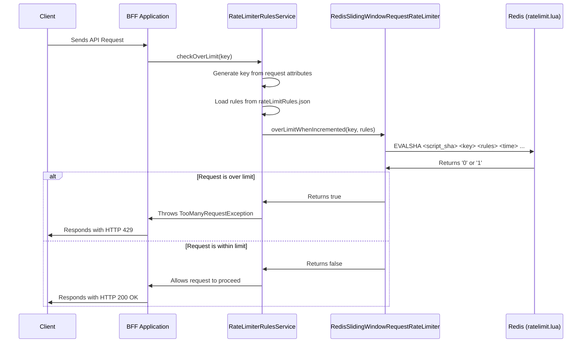

# Rate Limiter Documentation

This document explains how the rate limiting mechanism in this application works. The implementation uses a sliding window algorithm with Redis and a Lua script for high performance and atomicity.

## High-Level Overview

The rate limiter is designed to control the number of requests a user or system can make to the API within a specified time window. This is crucial for preventing abuse, ensuring fair usage, and protecting the application from denial-of-service attacks.

### Rate Limiting Flow Diagram



The core components of the rate limiter are:

1.  **`ratelimit.lua`**: A Lua script that runs on the Redis server to enforce rate limits atomically.
2.  **`RedisSlidingWindowRequestRateLimiter.java`**: A Java class that loads and executes the Lua script in Redis.
3.  **`RateLimiterRulesService.java`**: A service that manages rate-limiting rules and applies them to incoming requests.
4.  **`rateLimitRules.json`**: A JSON file where all the rate-limiting rules are defined.

## The `ratelimit.lua` Script

The `ratelimit.lua` script is the heart of the rate limiter. It implements a sliding window algorithm to track request counts over time. Here's how it works:

*   **Atomic Execution**: The script is executed atomically in Redis, which means it runs without interruption, preventing race conditions that could lead to incorrect rate-limiting decisions.
*   **Time-Based Buckets**: It divides time into small buckets and tracks the number of requests in each bucket. This allows for a smooth, rolling window for rate limiting.
*   **Efficient Cleanup**: It automatically cleans up expired request counts, ensuring that Redis memory is used efficiently.
*   **Flexible Rules**: It accepts a JSON-encoded array of rules, allowing for multiple rate limits to be applied to a single key (e.g., 100 requests per minute and 1000 requests per hour).

### Script Arguments

*   `KEYS`: The keys to apply the rate limit to (e.g., user ID, IP address).
*   `ARGV[1]`: A JSON string of rate limits, like `[[60, 100]]` (100 requests per 60 seconds).
*   `ARGV[2]`: The current Unix timestamp.
*   `ARGV[3]`: The "weight" of the request (defaults to 1).
*   `ARGV[4]`: A flag for a strict check (`>` vs. `>=`).

## Java Implementation

The Java code orchestrates the rate-limiting process by interacting with the Lua script in Redis.

### `RedisSlidingWindowRequestRateLimiter.java`

This class is the bridge to Redis. Its main responsibilities are:

*   **Connecting to Redis**: It establishes a connection to the Redis server.
*   **Loading the Script**: At startup, it loads the `ratelimit.lua` script into Redis and stores its SHA hash. This allows for efficient execution using the `EVALSHA` command.
*   **Executing the Script**: It provides methods like `overLimitWhenIncremented` that call the Lua script with the appropriate arguments (key, rules, timestamp, etc.) and return whether the request is over the limit.

#### Code

```java

import io.lettuce.core.RedisClient;
import io.lettuce.core.RedisNoScriptException;
import io.lettuce.core.api.StatefulRedisConnection;
import io.lettuce.core.api.reactive.RedisKeyReactiveCommands;
import io.lettuce.core.api.reactive.RedisScriptingReactiveCommands;
import io.micronaut.context.annotation.Context;
import io.micronaut.context.annotation.Value;
import jakarta.annotation.PostConstruct;
import org.slf4j.Logger;
import org.slf4j.LoggerFactory;
import reactor.core.publisher.Mono;
import tech.fplabs.onecard.redisRateLimiter.model.RequestLimitRule;

import jakarta.inject.Singleton;
import java.time.Duration;
import java.time.temporal.ChronoUnit;
import java.util.Set;

import static io.lettuce.core.ScriptOutputType.VALUE;
import static java.util.Objects.requireNonNull;

@Singleton
@Context
public class RedisSlidingWindowRequestRateLimiter {

    private static final Logger LOG = LoggerFactory.getLogger(RedisSlidingWindowRequestRateLimiter.class);

    private static final Duration BLOCK_TIMEOUT = Duration.of(5, ChronoUnit.SECONDS);

    private RedisScriptingReactiveCommands<String, String> redisScriptingReactiveCommands;

    private RedisKeyReactiveCommands<String, String> redisKeyCommands;

    private RedisScriptLoader scriptLoader;

    private RequestLimitRulesSupplier<String> requestLimitRulesSupplier;

    private TimeSupplier timeSupplier;

    private RedisClient client;
    private StatefulRedisConnection<String, String> connection;

    @Value("${redis.uri}")
    private String redisHost;

    @PostConstruct
    public void initializeRateLimiter(){
        client = requireNonNull(RedisClient.create(redisHost));
        this.redisScriptingReactiveCommands = getConnection().reactive();
        this.redisKeyCommands = getConnection().reactive();
        scriptLoader = new RedisScriptLoader(redisScriptingReactiveCommands, "ratelimit.lua");
        this.timeSupplier = new SystemTimeSupplier();
    }

    public void create(Set<RequestLimitRule> rules) {
        requireNonNull(rules, "rules can not be null");
        this.requestLimitRulesSupplier = new SerializedRequestLimitRulesSupplier(rules);
    }

    public void close() {
        client.shutdown();
    }

    private StatefulRedisConnection<String, String> getConnection() {
        // going to ignore race conditions at the cost of having multiple connections
        if (connection == null) {
            connection = client.connect();
        }
        return connection;
    }

    private static boolean startWithNoScriptError(Throwable throwable) {
        return throwable instanceof RedisNoScriptException;
    }

    public boolean overLimitWhenIncremented(String key, int weight) {
        return throwOnTimeout(eqOrGeLimitReactive(key, weight, true));
    }

    public Mono<Boolean> overLimitWhenIncrementedReactive(String key, int weight) {
        return eqOrGeLimitReactive(key, weight, true);
    }

    private Mono<Boolean> eqOrGeLimitReactive(String key, int weight, boolean strictlyGreater) {
        requireNonNull(key);
        String rulesJson =  requestLimitRulesSupplier.getRules(key);

        return Mono.zip(timeSupplier.getReactive(), scriptLoader.storedScript())
                .flatMapMany(tuple -> {
                    Long time = tuple.getT1();
                    RedisScriptLoader.StoredScript script = tuple.getT2();
                    return redisScriptingReactiveCommands
                            .evalsha(script.getSha(), VALUE, new String[]{key}, rulesJson, time.toString(), Integer.toString(weight), toStringOneZero(strictlyGreater))
                            .doOnError(RedisSlidingWindowRequestRateLimiter::startWithNoScriptError, e -> script.dispose());
                })
                .single()
                .map("1"::equals)
                .doOnSuccess(over -> {
                    if (over) {
                        LOG.debug("Requests matched by key '{}' incremented by weight {} are greater than {}the limit", key, weight, strictlyGreater ? "" : "or equal to ");
                    }
                });
    }

    private String toStringOneZero(boolean strictlyGreater) {
        return strictlyGreater ? "1" : "0";
    }

    private boolean throwOnTimeout(Mono<Boolean> mono) {
        Boolean result = mono.block(BLOCK_TIMEOUT);
        if (result == null) {
            throw new RuntimeException("waited " + BLOCK_TIMEOUT + "before timing out");
        }
        return result;
    }
}
```

### `RateLimiterRulesService.java`

This service is responsible for applying the rate-limiting logic to incoming requests:

*   **Loading Rules**: It loads the rate-limiting rules from the `rateLimitRules.json` file at application startup.
*   **Generating Keys**: It creates a unique key for each request based on its attributes, such as IP address, customer number, tenant ID, and the request path. This enables highly granular rate-limiting policies.
*   **Checking Limits**: For each incoming request, it determines the appropriate rule and key, and then uses `RedisSlidingWindowRequestRateLimiter` to check if the request is within the defined limits.
*   **Handling Violations**: If a request exceeds the limit, it throws a `TooManyRequestException`, which is then handled by a global exception handler to return a `429 Too Many Requests` HTTP status code.

#### Code

```java

import com.fasterxml.jackson.annotation.JsonAutoDetect;
import com.fasterxml.jackson.core.type.TypeReference;
import com.fasterxml.jackson.databind.DeserializationFeature;
import com.fasterxml.jackson.databind.ObjectMapper;
import com.fasterxml.jackson.databind.introspect.VisibilityChecker;
import com.fasterxml.jackson.datatype.jsr310.JavaTimeModule;
import io.micronaut.context.annotation.Context;
import io.micronaut.context.annotation.Value;
import io.micronaut.core.util.StringUtils;
import io.micronaut.jackson.modules.BeanIntrospectionModule;
import jakarta.annotation.PostConstruct;
import org.slf4j.Logger;
import org.slf4j.LoggerFactory;
import tech.fplabs.onecard.apis.pennydrop.model.CustomerAttributes;
import tech.fplabs.onecard.redisRateLimiter.exception.TooManyRequestException;
import tech.fplabs.onecard.redisRateLimiter.model.*;

import jakarta.inject.Inject;
import jakarta.inject.Singleton;
import java.io.FileNotFoundException;
import java.io.IOException;
import java.net.URL;
import java.time.Duration;
import java.util.*;

@Singleton
@Context
public class RateLimiterRulesService {
    private static final Logger LOGGER = LoggerFactory.getLogger(RateLimiterRulesService.class);

    private List<RateLimiterRulesResponse> rateLimiterRulesResponseList;

    @Value("${redis.uri}")
    private String redisHost;

    @Inject
    CustomerAttributes customerAttributes;

    @Inject
    RedisSlidingWindowRequestRateLimiter requestRateLimiter;

    @PostConstruct
    public void populateProfessionFrom(){
        rateLimiterRulesResponseList = populateRateLimiterRules();
    }

    private List<RateLimiterRulesResponse> populateRateLimiterRules(){
        try {
            ObjectMapper objectMapper = new ObjectMapper().registerModule(new JavaTimeModule()).registerModule(new BeanIntrospectionModule());;
            URL url = RateLimiterRulesService.class.getClassLoader().getResource("rateLimitRules.json");
            if(url == null){
                LOGGER.error("rateLimit rules Json file not found");
                throw new RuntimeException("Cannot load rate limit rules list");
            }
            LOGGER.debug("Successfully populated rateLimit rules from JSON");
            objectMapper.disable(DeserializationFeature.FAIL_ON_UNKNOWN_PROPERTIES);
            objectMapper.setVisibility(VisibilityChecker.Std.defaultInstance().withFieldVisibility(JsonAutoDetect.Visibility.ANY));
            return objectMapper.readValue(url, new TypeReference<List<RateLimiterRulesResponse>>() {});
        } catch (IOException e) {
            LOGGER.error("Exception in reading rateLimit rules Json file", e);
        }
        return new ArrayList<>();
    }

    public void checkOverLimit(RateLimiterKey key) {
        List<RateLimiterRulesResponse> rateLimiterRulesResponseList = getRateLimiterRuleList();
        Optional<RateLimiterRulesResponse> limiterRulesResponse = rateLimiterRulesResponseList.stream().filter(response -> response.getKey().equals(key)).findFirst();
        if(limiterRulesResponse.isPresent()) {
            String[] rateLimiterTypes = RateLimiterType.getNames(RateLimiterType.class);
            for(String type: rateLimiterTypes) {
                checkApiRateLimit(limiterRulesResponse.get(), type);
            }
        }
    }

    public void checkApiRateLimit(RateLimiterRulesResponse limiterRulesResponse, String type) {
        List<RuleDetail> ruleDetailList = limiterRulesResponse.getRuleDetails();
        Optional<RuleDetail> ruleDetailOpt = ruleDetailList.stream().filter(ruleDetail -> RateLimiterType.valueOf(type).equals(ruleDetail.type)).findFirst();
        if(ruleDetailOpt.isPresent()) {
            Set<RequestLimitRule> rules = getRules(ruleDetailOpt.get());
            String key = getKey(type);
            if(key != null)
                checkOverLimit(rules, key, type);
        }
    }

    private String getKey(String type) {
        String key = "";
        if(RateLimiterType.valueOf(type).equals(RateLimiterType.IP) && customerAttributes.getSourceIp() != null)
            key = customerAttributes.getSourceIp();
        else if(RateLimiterType.valueOf(type).equals(RateLimiterType.CUSTOMER_NO) && customerAttributes.getCustomerNo() != null)
            key = customerAttributes.getCustomerNo();
        else if(RateLimiterType.valueOf(type).equals(RateLimiterType.TENANT_ID) && customerAttributes.getTenantId() != null)
            key = customerAttributes.getTenantId().toString();
        else if(RateLimiterType.valueOf(type).equals(RateLimiterType.PRODUCT_CODE) && customerAttributes.getProductCode() != null)
            key = customerAttributes.getProductCode().name();

        if(StringUtils.isNotEmpty(key))
            return  "rate-limiter:" + key + ":" + customerAttributes.getRequestPath() + ":" + type;
        else
            return null;
    }

    private void checkOverLimit(Set<RequestLimitRule> rules, String key, String type) {
        requestRateLimiter.create(rules);
        Boolean overLimit = requestRateLimiter.overLimitWhenIncrementedReactive(key).block();
        if(Boolean.TRUE.equals(overLimit)) {
            LOGGER.error("customer exceeded it's limit for type: {} and customer no is {} and IP : {}", type, customerAttributes.getCustomerNo(), customerAttributes.getSourceIp());
            throw new TooManyRequestException();
        }
    }

    private Set<RequestLimitRule> getRules(RuleDetail ruleDetail) {
        Set<RequestLimitRule> rules = new HashSet<>();
        for(RateLimitRule rule : ruleDetail.getRules()){
            if(rule.getPrecision() != 0)
                rules.add(RequestLimitRule.of(Duration.ofSeconds(rule.getDurationSeconds()), rule.getLimit()).withPrecision(Duration.ofSeconds(rule.getPrecision())));
            else
                rules.add(RequestLimitRule.of(Duration.ofSeconds(rule.getDurationSeconds()), rule.getLimit()));
        }
        return rules;
    }
}
```

## How Rate Limiting is Triggered

The rate limiting is **not** automatically applied to every API endpoint. It is selectively enabled using a Micronaut `MethodInterceptor`. This interceptor is triggered by a custom `@RateLimiter` annotation that must be added to the specific methods you want to protect.

### The `@RateLimiter` Annotation

To apply rate limiting to a controller method, you simply annotate it with `@RateLimiter` and provide the `type`, which must correspond to one of the keys defined in `rateLimitRules.json`.

Here is an example of how to protect an endpoint:

```java
import tech.fplabs.onecard.aspects.RateLimiter;
import tech.fplabs.onecard.redisRateLimiter.model.RateLimiterKey;

@Controller("/some/path")
public class MyController {

    @Get("/status")
    @RateLimiter(type = RateLimiterKey.WEB_APPLICATION_STATUS) // <-- This enables rate limiting
    public String getStatus() {
        // This code will only execute if the rate limit is not exceeded
        return "OK";
    }
}
```

### The `RateLimiterInterceptor.java`

This class intercepts any method call that is annotated with `@RateLimiter`. Before executing the actual method, the interceptor's `intercept` method runs, which contains the core logic for applying the rate limit.

#### Code

```java

import io.micronaut.aop.MethodInterceptor;
import io.micronaut.aop.MethodInvocationContext;
import io.micronaut.context.annotation.Value;
import org.slf4j.Logger;
import org.slf4j.LoggerFactory;
import tech.fplabs.onecard.redisRateLimiter.RateLimiterRulesService;
import tech.fplabs.onecard.redisRateLimiter.model.RateLimiterKey;

import jakarta.inject.Inject;
import jakarta.inject.Singleton;

@Singleton
public class RateLimiterInterceptor implements MethodInterceptor<Object, Object> {

    private static final Logger LOGGER = LoggerFactory.getLogger(RateLimiterRulesService.class);
    @Inject
    RateLimiterRulesService rateLimiterRulesService;

    @Value("${filter.rate-limiter-filter.blocking-enabled}")
    private boolean blockingEnabled;

    @Override
    public Object intercept(MethodInvocationContext<Object, Object> context) {
        if(blockingEnabled) {
            return context.proceed(); // Rate limiting is globally disabled
        }
        // Get the 'type' from the annotation
        String key = (String) context.getAnnotation(RateLimiter.class).getValues().get("type");
        
        // Call the rate limiting service
        rateLimiterRulesService.checkOverLimit(RateLimiterKey.valueOf(key));
        
        // If no exception was thrown, proceed to the original method
        return context.proceed();
    }
}
```

#### Explanation of the Flow

1.  When a request is made to an annotated method (e.g., `getStatus()`), the `RateLimiterInterceptor`'s `intercept` method is called first.
2.  It checks the `blocking-enabled` flag from `application.yml`. If `true`, it skips rate limiting entirely.
3.  It extracts the `type` (e.g., `WEB_APPLICATION_STATUS`) from the `@RateLimiter` annotation on the method.
4.  It calls `rateLimiterRulesService.checkOverLimit()` with this key.
5.  If the request is over the limit, the service throws a `TooManyRequestException`, which prevents the original method from being executed and results in an `HTTP 429` error.
6.  If the request is within the limit, the `intercept` method calls `context.proceed()`, allowing the original controller method to run.

## Configuring Rate-Limiting Rules

All rate-limiting rules are defined in the `src/main/resources/rateLimitRules.json` file. This file contains a list of rules, where each rule specifies:

*   **`key`**: A unique identifier for the rule (e.g., `PENNY_DROP_LIMIT`).
*   **`ruleDetails`**: A list of details for different rate-limiting types (`IP`, `CUSTOMER_NO`, etc.).
*   **`rules`**: A list of the actual rate limits, each with a `durationSeconds` and a `limit`.

Here is an example of a rule:

```json
[
  {
    "key": "PENNY_DROP_LIMIT",
    "ruleDetails": [
      {
        "type": "IP",
        "rules": [
          {
            "durationSeconds": 60,
            "limit": 10
          },
          {
            "durationSeconds": 3600,
            "limit": 100
          }
        ]
      }
    ]
  }
]
```

This rule limits requests for the `PENNY_DROP_LIMIT` key from a single IP address to 10 requests per minute and 100 requests per hour.

## Lua Scripts Explained

This application uses several Lua scripts to perform atomic operations in Redis. Here is a detailed breakdown of each one.

### `ratelimit.lua`

This is the core script for enforcing rate limits using a sliding window algorithm.

#### Code

```lua
-- Credit: http://www.dr-josiah.com/2014/11/introduction-to-rate-limiting-with_26.html

local limits = cjson.decode(ARGV[1])
local now = tonumber(ARGV[2])
local weight = tonumber(ARGV[3] or '1')
local strictly_greater = tonumber(ARGV[4] or '1') == 1
local longest_duration = limits[1][1] or 0
local saved_keys = {}
local ge_limit = '0'

-- handle cleanup and limit checks
for i, limit in ipairs(limits) do
    local duration = limit[1]
    longest_duration = math.max(longest_duration, duration)
    local precision = limit[3] or duration
    precision = math.min(precision, duration)
    local blocks = math.ceil(duration / precision)
    local saved = {}
    table.insert(saved_keys, saved)
    saved.block_id = math.floor(now / precision)
    saved.trim_before = saved.block_id - blocks + 1
    saved.count_key = duration .. ':' .. precision .. ':'
    saved.ts_key = saved.count_key .. 'o'

    for j, key in ipairs(KEYS) do
        local old_ts = redis.call('HGET', key, saved.ts_key)
        old_ts = old_ts and tonumber(old_ts) or saved.trim_before
        if old_ts > now then
            -- don't write in the past
            return '1'
        end
        -- discover what needs to be cleaned up
        local decr = 0
        local dele = {}
        local trim = math.min(saved.trim_before, old_ts + blocks)
        for old_block = old_ts, trim - 1 do
            local bkey = saved.count_key .. old_block
            local bcount = redis.call('HGET', key, bkey)
            if bcount then
                decr = decr + tonumber(bcount)
                table.insert(dele, bkey)
            end
        end
        -- handle cleanup
        local cur
        if #dele > 0 then
            redis.call('HDEL', key, unpack(dele))
            if decr ~= 0 then
                cur = redis.call('HINCRBY', key, saved.count_key, -decr)
            end
        else
            cur = redis.call('HGET', key, saved.count_key)
        end
        -- check our limits
        local count = tonumber(cur or '0') + weight
        if count > limit[2] then
            return '1' -- over limit, don't record request
        elseif count == limit[2] and not strictly_greater then
            ge_limit = '1' -- at limit, do record request
        end
    end
end

-- there is enough resources, update the counts IFF needed
if weight ~= 0 then
    for i, limit in ipairs(limits) do
        local saved = saved_keys[i]
        for j, key in ipairs(KEYS) do
            -- update the current timestamp, count, and bucket count
            redis.call('HSET', key, saved.ts_key, saved.trim_before)
            redis.call('HINCRBY', key, saved.count_key, weight)
            redis.call('HINCRBY', key, saved.count_key .. saved.block_id, weight)
        end
    end
end

-- We calculated the longest-duration limit so we can EXPIRE
-- the whole HASH for quick and easy idle-time cleanup :)
if longest_duration > 0 then
    for _, key in ipairs(KEYS) do
        redis.call('EXPIRE', key, longest_duration)
    end
end
return ge_limit
```

#### Explanation

*   **Purpose**: To check and increment request counts against one or more rate limits in an atomic way.
*   **Arguments**:
    *   `KEYS[1]...`: One or more keys to apply the limit to (e.g., `rate-limiter:127.0.0.1:/api/status:IP`).
    *   `ARGV[1]`: A JSON string defining the limits, e.g., `[[60, 100]]` for 100 requests per 60 seconds.
    *   `ARGV[2]`: The current Unix timestamp.
    *   `ARGV[3]`: The weight of the request (defaults to `1`).
    *   `ARGV[4]`: A flag (`1` or `0`) for whether the check is strictly greater (`>`) or greater than or equal to (`>=`).
*   **Logic**: The script divides time into buckets. Before checking the limit, it cleans up expired buckets. If the new request (with its `weight`) is within the limit, it increments the count for the current time bucket and the total count for the window. It also sets an expiration on the Redis key to ensure automatic cleanup of inactive data.
*   **Returns**: `'1'` if the request is over the limit, `'0'` otherwise.
