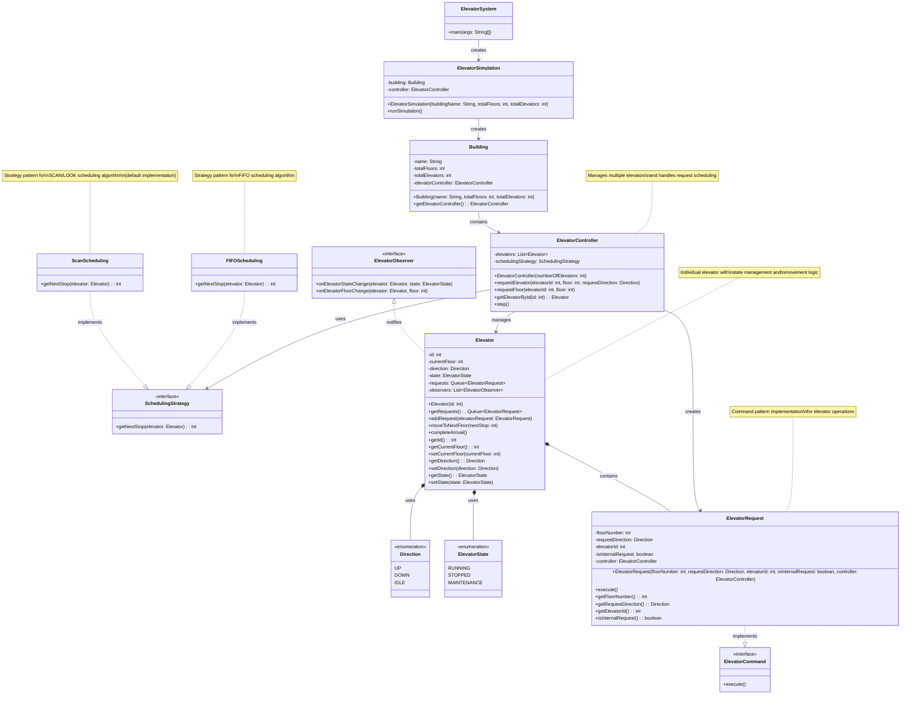
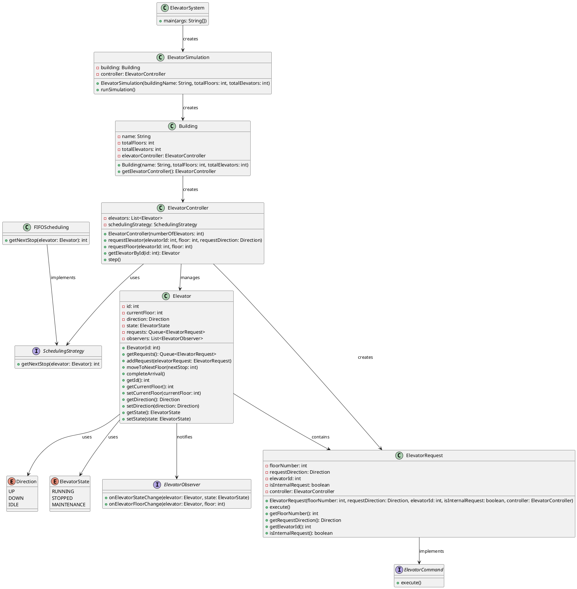

# Elevator System Class Diagram

## ASCII Class Diagram

```
┌─────────────────────────────────────────────────────────────────────────────────────┐
│                            ELEVATOR SYSTEM                                     │
└─────────────────────────────────────────────────────────────────────────────────────┘

┌─────────────────────┐    ┌─────────────────────┐    ┌─────────────────────┐
│   ElevatorSystem    │    │    Building         │    │ ElevatorSimulation  │
│─────────────────────│    │─────────────────────│    │─────────────────────│
│ +main(args[])      │    │ -name: String      │    │ -building: Building │
│                    │    │ -totalFloors: int  │    │ -controller: Ctrl   │
└─────────────────────┘    │ -totalElevators: int│    │─────────────────────│
         │                │ -controller: Ctrl   │    │ +runSimulation()    │
         │                │─────────────────────│    └─────────────────────┘
         │                │ +getController()    │              │
         │                └─────────────────────┘              │
         │                         │                         │
         │                         │                         │
         ▼                         ▼                         ▼

┌─────────────────────────────────────────────────────────────────────────────────────┐
│                        ElevatorController                                       │
│─────────────────────────────────────────────────────────────────────────────────────│
│ -elevators: List<Elevator>                                                    │
│ -schedulingStrategy: SchedulingStrategy                                          │
│─────────────────────────────────────────────────────────────────────────────────────│
│ +ElevatorController(numElevators)                                              │
│ +requestElevator(id, floor, direction)                                         │
│ +requestFloor(id, floor)                                                       │
│ +getElevatorById(id)                                                          │
│ +step()                                                                       │
└─────────────────────────────────────────────────────────────────────────────────────┘
                                    │
                                    │ uses
                                    ▼
┌─────────────────────┐    ┌─────────────────────┐    ┌─────────────────────┐
│     Elevator        │    │  ElevatorRequest   │    │ SchedulingStrategy  │
│─────────────────────│    │─────────────────────│    │─────────────────────│
│ -id: int           │    │ -floorNumber: int  │    │ +getNextStop(e)     │
│ -currentFloor: int │    │ -requestDirection  │    └─────────────────────┘
│ -direction: Dir    │    │ -elevatorId: int   │              ▲
│ -state: State      │    │ -isInternal: bool  │              │
│ -requests: Queue   │    │ -controller: Ctrl  │              │ implements
│ -observers: List   │    │─────────────────────│              │
│─────────────────────│    │ +execute()         │    ┌─────────────────────┐
│ +Elevator(id)      │    │ +getFloorNumber()  │    │   FIFOScheduling   │
│ +addRequest(req)   │    │ +getRequestDir()   │    │─────────────────────│
│ +moveToNextFloor() │    │ +getElevatorId()   │    │ +getNextStop(e)     │
│ +completeArrival() │    │ +isInternal()      │    └─────────────────────┘
│ +addObserver(obs)   │    └─────────────────────┘
└─────────────────────┘              │ implements
                                    ▼
                          ┌─────────────────────┐
                          │  ElevatorCommand   │
                          │─────────────────────│
                          │ +execute()         │
                          └─────────────────────┘

┌─────────────────────┐    ┌─────────────────────┐    ┌─────────────────────┐
│    Direction        │    │   ElevatorState    │    │ ElevatorObserver   │
│─────────────────────│    │─────────────────────│    │─────────────────────│
│ UP                 │    │ RUNNING            │    │ +onStateChange()   │
│ DOWN               │    │ STOPPED            │    │ +onFloorChange()   │
│ IDLE               │    │ MAINTENANCE        │    └─────────────────────┘
└─────────────────────┘    └─────────────────────┘
```

## Mermaid Class Diagram



## PlantUML Class Diagram



## Design Patterns Used

### 1. **Command Pattern**
- **Command Interface**: `ElevatorCommand`
- **Concrete Command**: `ElevatorRequest`
- **Invoker**: `ElevatorController`
- **Receiver**: `Elevator`

### 2. **Strategy Pattern**
- **Strategy Interface**: `SchedulingStrategy`
- **Concrete Strategy**: `FIFOScheduling`
- **Context**: `ElevatorController`

### 3. **Observer Pattern**
- **Subject**: `Elevator`
- **Observer Interface**: `ElevatorObserver`
- **Concrete Observers**: Can be implemented for UI, logging, etc.

### 4. **State Pattern**
- **State Enum**: `ElevatorState`
- **Context**: `Elevator`

## Key Relationships

1. **Composition**: `Building` has `ElevatorController`
2. **Aggregation**: `ElevatorController` manages multiple `Elevator` objects
3. **Association**: `Elevator` processes `ElevatorRequest` objects
4. **Implementation**: `FIFOScheduling` implements `SchedulingStrategy`
5. **Dependency**: `ElevatorController` depends on `SchedulingStrategy`

## Data Flow

1. **External Request** → `ElevatorController.requestElevator()`
2. **Internal Request** → `ElevatorController.requestFloor()`
3. **Request Processing** → `Elevator.addRequest()`
4. **Scheduling** → `FIFOScheduling.getNextStop()`
5. **Movement** → `Elevator.moveToNextFloor()`
6. **State Updates** → `ElevatorObserver` notifications
