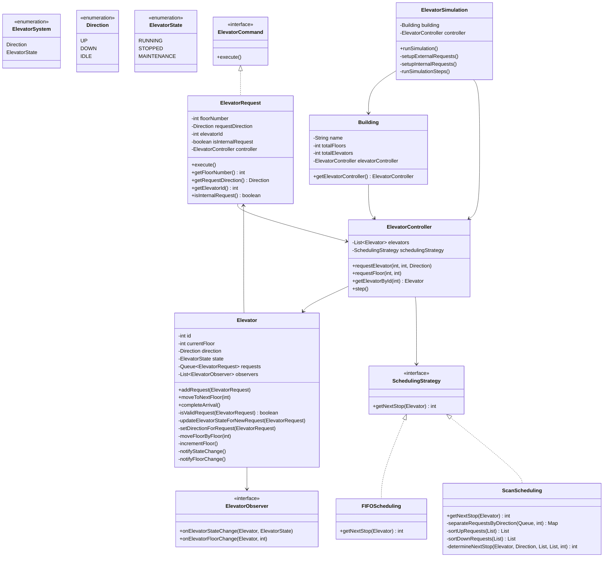
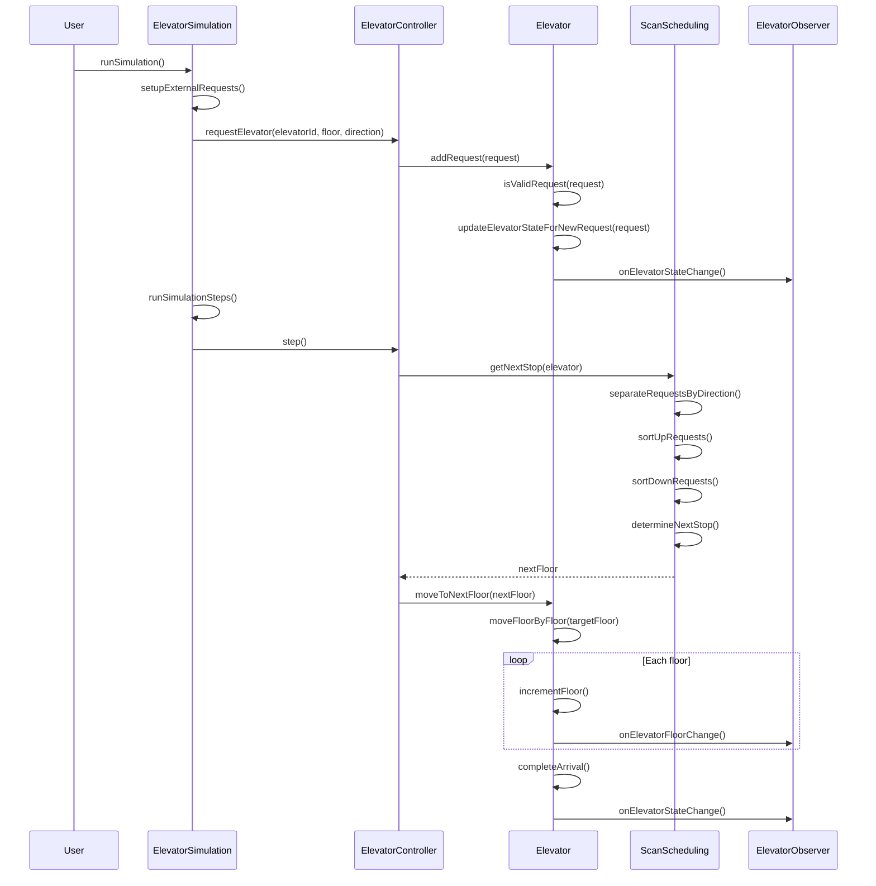
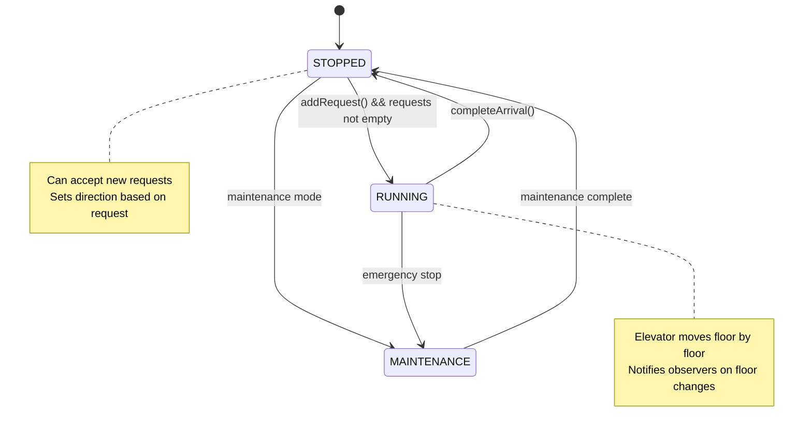
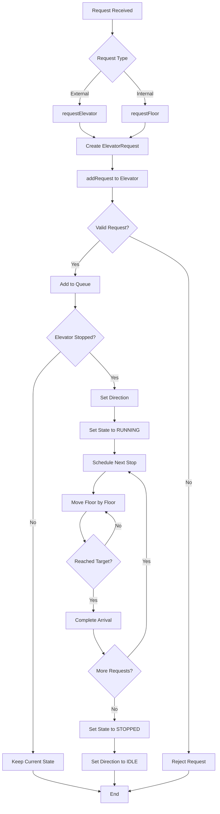

# Elevator System Architecture - Mermaid Diagram

## Class Diagram



## Sequence Diagram - Request Processing



## State Diagram - Elevator States



## Component Diagram - System Architecture

```mermaid
graph TB
    subgraph "Elevator System"
        subgraph "Core Components"
            ElevatorController[Controller]
            Elevator[Elevator]
            Scheduling[Scheduling Strategy]
        end
        
        subgraph "Request Management"
            Request[Elevator Request]
            Command[Command Interface]
        end
        
        subgraph "Observation System"
            Observer[Observer Interface]
            Display[Display System]
            Logger[Logger System]
        end
        
        subgraph "Simulation"
            Simulation[Elevator Simulation]
            Building[Building]
        end
    end
    
    %% Connections
    ElevatorController --> Elevator
    ElevatorController --> Scheduling
    Request --> Command
    Elevator --> Request
    Elevator --> Observer
    Observer --> Display
    Observer --> Logger
    Simulation --> Building
    Simulation --> ElevatorController
    
    %% Style
    classDef core fill:#e1f5fe
    classDef request fill:#f3e5f5
    classDef observation fill:#e8f5e8
    classDef simulation fill:#fff3e0
    
    class ElevatorController,Elevator,Scheduling core
    class Request,Command request
    class Observer,Display,Logger observation
    class Simulation,Building simulation
```

## Activity Diagram - Request Processing Flow



## Design Patterns Used

```mermaid
mindmap
  root((Elevator System))
    Command Pattern
      ElevatorRequest implements ElevatorCommand
      execute() method
    Strategy Pattern
      SchedulingStrategy interface
      FIFO implementation
      SCAN implementation
    Observer Pattern
      ElevatorObserver interface
      State change notifications
      Floor change notifications
    State Pattern
      ElevatorState enum
      RUNNING, STOPPED, MAINTENANCE
      State transitions
```
