# LMS Class Diagram - Design Patterns Implementation

```mermaid
classDiagram
    %% ==================== MODELS ====================
    class Students {
        -int id
        -String name
        -String mobile
        +getId() int
        +setId(int) void
        +getName() String
        +setName(String) void
        +getMobile() String
        +setMobile(String) void
    }

    class Teacher {
        -int id
        -String name
        -String mobile
        +getId() int
        +setId(int) void
        +getName() String
        +setName(String) void
        +getMobile() String
        +setMobile(String) void
    }

    class Questions {
        -String id
        -String name
        -String description
        -String type
        -String options
        -int marks
        -String ans
        +getId() String
        +getAns() String
        +getMarks() int
    }

    class Quiz {
        -int id
        -int totalMarks
        -int passingMarks
        -List~Questions~ questions
        +getId() int
        +setId(int) void
        +getTotalMarks() int
        +setTotalMarks(int) void
        +getPassingMarks() int
        +setPassingMarks(int) void
        +getQuestions() List~Questions~
        +setQuestions(List~Questions~) void
    }

    class Course {
        -int id
        -String name
        -String description
        -String instructor
        -String language
        -String status
        -List~Quiz~ quizList
        -CourseState currentState
        +getId() int
        +setId(int) void
        +getName() String
        +setName(String) void
        +getDescription() String
        +setDescription(String) void
        +getInstructor() String
        +setInstructor(String) void
        +getLanguage() String
        +setLanguage(String) void
        +getStatus() String
        +setStatus(String) void
        +getQuizList() List~Quiz~
        +setQuizList(List~Quiz~) void
        +getCurrentState() CourseState
        +setCurrentState(CourseState) void
        +publish() void
        +archive() void
        +addQuiz(Quiz) void
        +enroll(int) void
    }

    %% ==================== COMMAND PATTERN ====================
    class Command {
        <<interface>>
        +execute() void
        +undo() void
    }

    class CommandImpl {
        -Runnable executeAction
        -Runnable undoAction
        +CommandImpl(Runnable, Runnable)
        +execute() void
        +undo() void
    }

    class CommandInvoker {
        -Stack~Command~ commandHistory
        -int MAX_HISTORY
        +executeCommand(Command) void
        +undo() void
    }

    Command <|-- CommandImpl
    CommandInvoker --> Command : uses

    %% ==================== COURSE STATE PATTERN ====================
    class CourseState {
        <<interface>>
        +publish(Course) void
        +archive(Course) void
        +addQuiz(Course, Quiz) void
        +enroll(Course, int) void
    }

    class DraftCourse {
        +publish(Course) void
        +archive(Course) void
        +addQuiz(Course, Quiz) void
        +enroll(Course, int) void
    }

    class PublishCourse {
        +publish(Course) void
        +archive(Course) void
        +addQuiz(Course, Quiz) void
        +enroll(Course, int) void
    }

    class ArchiveCourse {
        +publish(Course) void
        +archive(Course) void
        +addQuiz(Course, Quiz) void
        +enroll(Course, int) void
    }

    CourseState <|-- DraftCourse
    CourseState <|-- PublishCourse
    CourseState <|-- ArchiveCourse
    Course --> CourseState : has

    %% ==================== QUIZ STATE PATTERN ====================
    class QuizState {
        <<interface>>
        +startQuiz(QuizAttempt) void
        +submitAnswer(QuizAttempt, int, String) void
        +submitQuiz(QuizAttempt) void
        +getResult(QuizAttempt) int
    }

    class NotStartedState {
        +startQuiz(QuizAttempt) void
        +submitAnswer(QuizAttempt, int, String) void
        +submitQuiz(QuizAttempt) void
        +getResult(QuizAttempt) int
    }

    class InProgressState {
        +startQuiz(QuizAttempt) void
        +submitAnswer(QuizAttempt, int, String) void
        +submitQuiz(QuizAttempt) void
        +getResult(QuizAttempt) int
    }

    class SubmittedState {
        +startQuiz(QuizAttempt) void
        +submitAnswer(QuizAttempt, int, String) void
        +submitQuiz(QuizAttempt) void
        +getResult(QuizAttempt) int
    }

    class GradedState {
        -GradingService gradingService
        +GradedState(GradingService)
        +startQuiz(QuizAttempt) void
        +submitAnswer(QuizAttempt, int, String) void
        +submitQuiz(QuizAttempt) void
        +getResult(QuizAttempt) int
    }

    class QuizAttempt {
        -QuizState currentState
        -Students student
        -Quiz quiz
        -Map~Integer, String~ answers
        +QuizAttempt(Students, Quiz)
        +getQuiz() Quiz
        +getAnswers() Map~Integer, String~
        +setCurrentState(QuizState) void
        +startQuiz() void
        +submitAns(int, String) void
        +submitQuiz() void
        +getResult() int
    }

    QuizState <|-- NotStartedState
    QuizState <|-- InProgressState
    QuizState <|-- SubmittedState
    QuizState <|-- GradedState
    QuizAttempt --> QuizState : has

    %% ==================== GRADING STRATEGY PATTERN ====================
    class GradingStrategy {
        <<interface>>
        +calculateGrade(QuizAttempt) int
    }

    class AutoGradeingService {
        +calculateGrade(QuizAttempt) int
    }

    class GradingService {
        -GradingStrategy gradingStrategy
        +GradingService(GradingStrategy)
        +calculateMarks(QuizAttempt) int
    }

    GradingStrategy <|-- AutoGradeingService
    GradingService --> GradingStrategy : uses
    GradedState --> GradingService : uses

    %% ==================== SERVICES ====================
    class StudentService {
        -Map~Integer, Students~ studentMap
        +StudentService()
        +createStudent(Students) Students
        +getStudent(int) Students
    }

    class TeacherService {
        -Map~Integer, Teacher~ teacherMap
        -Map~Integer, List~Integer~~ courseMap
        -CourseService courseService
        +TeacherService()
        +createTeacher(Teacher) Teacher
        +getTeacher(int) Teacher
    }

    class CourseService {
        -Map~Integer, Course~ courseMap
        +CourseService()
        +createCourse(Course) Course
        +getCourse(int) Course
        +publishCourse(int) void
        +archiveCourse(int) void
        +addQuizToCourse(int, Quiz) void
        +enrollStudentInCourse(int, int) void
    }

    class QuizService {
        -Map~Integer, Quiz~ quizMap
        -Map~String, QuizAttempt~ attemptMap
        -CourseService courseService
        -CommandInvoker commandInvoker
        +QuizService()
        +QuizService(CourseService)
        +createQuiz(Quiz) Quiz
        +getQuiz(int) Quiz
        +addQuizToCourse(int, Quiz) void
        +startQuiz(Students, int) QuizAttempt
        +submitAns(int, int, int, String) void
        +submitQuiz(int, int) void
    }

    class EnrollmentService {
        -Map~Integer, List~Integer~~ studentCourseMap
        -Map~Integer, List~Integer~~ courseStudentMap
        -CommandInvoker invoker
        -CourseService courseService
        +EnrollmentService()
        +EnrollmentService(CourseService)
        +enroll(int, int) void
        +getEnrolledStudent(int) List~Integer~
    }

    %% ==================== FACADE PATTERN ====================
    class LMSManager {
        -StudentService studentService
        -TeacherService teacherService
        -CourseService courseService
        -QuizService quizService
        -EnrollmentService enrollmentService
        +LMSManager()
        +registerStudent(Students) Students
        +registerTeacher(Teacher) Teacher
        +enrollStudent(int, int) void
        +createCourse(Course) Course
        +createQuiz(Quiz) Quiz
        +addQuizToCourse(int, Quiz) void
        +publishCourse(int) void
        +archiveCourse(int) void
        +startQuiz(Students, int) QuizAttempt
        +submitAnswer(int, int, int, String) void
        +submitQuiz(int, int) void
    }

    %% ==================== RELATIONSHIPS ====================
    
    %% Service Dependencies
    LMSManager --> StudentService : uses
    LMSManager --> TeacherService : uses
    LMSManager --> CourseService : uses
    LMSManager --> QuizService : uses
    LMSManager --> EnrollmentService : uses
    
    %% Service to Model Relationships
    StudentService --> Students : manages
    TeacherService --> Teacher : manages
    CourseService --> Course : manages
    QuizService --> Quiz : manages
    QuizService --> QuizAttempt : manages
    EnrollmentService --> Course : validates
    EnrollmentService --> CommandInvoker : uses
    
    %% Model Relationships
    Course --> Quiz : contains
    Quiz --> Questions : contains
    QuizAttempt --> Quiz : references
    QuizAttempt --> Students : references
    
    %% Pattern Implementations
    QuizService --> CommandInvoker : uses
    EnrollmentService --> CommandInvoker : uses
    QuizService --> CourseService : uses
    EnrollmentService --> CourseService : uses
    TeacherService --> CourseService : uses
    
    %% State Pattern Implementation
    Course *-- CourseState : composition
    QuizAttempt *-- QuizState : composition
    
    %% Strategy Pattern Implementation
    GradingService *-- GradingStrategy : composition
```

## Design Patterns Summary

### 🎯 **Command Pattern**
- **Components**: `Command`, `CommandImpl`, `CommandInvoker`
- **Usage**: Undoable quiz addition and student enrollment
- **Benefits**: Encapsulates operations as objects, supports undo/redo

### 🔄 **State Pattern** 
- **Course States**: `DraftCourse` → `PublishCourse` → `ArchiveCourse`
- **Quiz States**: `NotStartedState` → `InProgressState` → `SubmittedState` → `GradedState`
- **Benefits**: Clean state transitions, encapsulates state-specific behavior

### 🎲 **Strategy Pattern**
- **Components**: `GradingStrategy`, `AutoGradeingService`, `GradingService`
- **Usage**: Swappable grading algorithms
- **Benefits**: Easy to extend with new grading strategies

### 🏛️ **Facade Pattern**
- **Component**: `LMSManager`
- **Usage**: Single entry point for all LMS operations
- **Benefits**: Simplified API, hides complexity

### 📊 **Key Features**
- ✅ **State Guards**: Prevent invalid operations (e.g., enroll in draft course)
- ✅ **Automatic Transitions**: State changes happen automatically
- ✅ **Undo Support**: Command pattern tracks operation history
- ✅ **Extensible**: Easy to add new states, strategies, or commands
- ✅ **Clean Separation**: Each service has clear responsibilities
