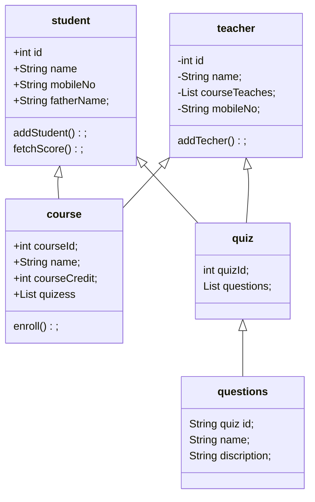

Welcome to the practice session atul kumar! 👋

Here's the problem description:

Design a Learning Management System

Design a system for an online learning platform that allows instructors to create courses, students to enroll in courses,
 and both to track progress. Consider features like quizzes, assignments, grading, and certificates.

Since this is a practice session, I am here to guide you rather than test you. Feel free to ask me
for hints or any question related to the problem stated above.

1. admin can create courses
2. teacher can view courses and add check the student progress.
3. student can enroll in courses and view their progress.
4. quize auto-gradeing/setting quizes
5. issue course certificate.

oops entities
    1.Student
    2.teacher
    3.course
    4.quiz
    5.certificate

strategy 
    use when alforithm changes based on config

Grading 
Certicate eligibility

Factory/abstract factory
    use when object creation depends on input 
    1.QuestionFactory
    2.NotificationFactory
observer(Pub/Sub)
    use when many things should react to an event
    1.quiz submitted
        -grading service
        -progress service
        -teacher dashboard
state
    use when an entity changes behavior based on lifecycle state 
    courseState
    EnrollmentState
    QuizAttemptState
template Method

Command
    createCourse,PublishCourse,EnrollStudent,EnrollStudentCommand
Decorator
    use when you want to add features withour exploding subclass 