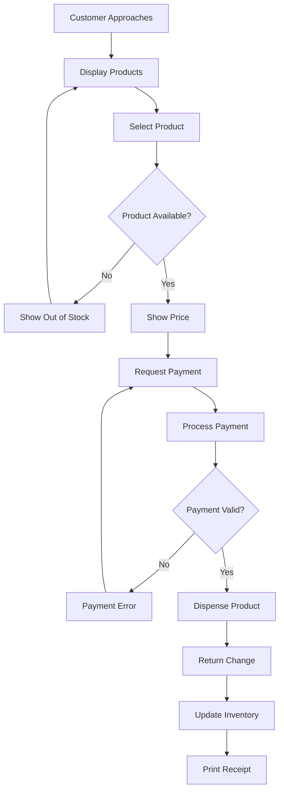
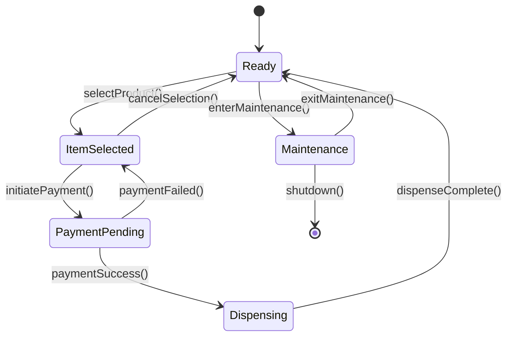

# 🏪 Vending Machine System Design

## 📋 Overview

A comprehensive vending machine system designed to efficiently manage product inventory, handle customer selections, process payments, and dispense products. The system supports multiple product types, manages inventory availability, handles various payment methods, and provides a seamless purchase experience with reliable state management and payment strategies.

---

## 🎯 System Requirements

### **Core Functionality**
- ✅ Multi-product support with various categories (beverages, snacks, etc.)
- ✅ Real-time inventory management and tracking
- ✅ Multiple payment methods (cash, credit card, mobile payment)
- ✅ State-based operation flow
- ✅ Secure transaction processing
- ✅ Maintenance mode support

### **System Rules**

#### **🔧 Setup Requirements**
- **Product Management**: Inventory of products with attributes (ID, name, price, category, quantity)
- **Inventory Tracking**: Real-time availability monitoring and stock management
- **Machine Configuration**: Location-based setup with unique machine identification

#### **🔄 Operational Flow**
- **Product Selection**: Users browse and select available products
- **State Management**: Machine transitions through states (ready → selected → payment → dispensing)
- **Payment Processing**: Secure validation and processing of multiple payment types
- **Product Dispensing**: Automated delivery upon successful payment

#### **🛡️ Safety & Security**
- **Stock Validation**: Prevents dispensing out-of-stock items
- **Payment Security**: Validates and secures all transactions
- **Audit Trail**: Complete tracking of purchases and inventory changes
- **Maintenance Safety**: Blocks user interactions during servicing

---

## 📝 Requirements Clarification

### **Interviewer Requirements**
> "We want a system that:
> • Supports multiple product types within a single vending machine
> • Handles coin-based payment methods efficiently  
> • Manages state transitions of the vending machine during operations"

### **Candidate Summary**
> "Key requirements include:
> • Vending machine with various product categories
> • State management for product selection to dispensing flow
> • Coin-based payment implementation with multiple payment methods
> • Edge case handling (out-of-stock, payment failures, maintenance)"

---

## 🏗️ System Architecture

### **Core Entities**

| Entity | Description | Key Attributes |
|--------|-------------|----------------|
| **Customer** | User interacting with the system | ID, name, preferred payment |
| **Product** | Items available for purchase | SKU, name, price, category, quantity |
| **Inventory** | Stock management system | Product slots, quantities, availability |
| **VendingMachine** | Main system controller | ID, location, state, services |
| **Payment** | Transaction payment details | Amount, method, status, timestamp |

### **Service Layer Architecture**

#### **💳 Payment Service (Strategy Pattern)**
```
Payment Strategy Implementation:
├── Coin Payment
│   ├── Coin inventory management
│   ├── Change calculation
│   └── Cash validation
├── Card Payment  
│   ├── Card validation
│   ├── Transaction processing
│   └── Security verification
└── Mobile Payment
    ├── Mobile wallet integration
    ├── QR code processing
    └── Provider authentication
```

#### **📦 Inventory Service (Observer Pattern)**
```
Inventory Management:
├── Stock Monitoring
│   ├── Real-time quantity tracking
│   ├── Low stock alerts
│   └── Out-of-stock notifications
├── Product Category Management
│   ├── Beverage category
│   ├── Snacks category
│   └── Custom categories
└── Stock Level Analysis
    ├── Demand forecasting
    ├── Restocking schedules
    └── Performance metrics
```

#### **💰 Pricing Service**
```
Pricing Operations:
├── Base Price Management
├── Discount Application
├── Tax Calculation
└── Total Price Computation
```

#### **🎯 Dispensing Service (Command Pattern)**
```
Dispensing Operations:
├── Product Dispensing
│   ├── Slot identification
│   ├── Product retrieval
│   └── Delivery confirmation
├── Change Return
│   ├── Amount calculation
│   ├── Coin dispensing
│   └── Balance verification
└── Product Return (Refunds)
    ├── Transaction rollback
    ├── Product restoration
    └── Payment refund
```

#### **🔄 Vending Machine Manager (State Pattern)**
```
State Flow Management:
├── Ready State
│   ├── Awaiting user input
│   ├── Display available products
│   └── Accept selections
├── Item Selected State
│   ├── Confirm selection
│   ├── Display price
│   └── Request payment
├── Payment Pending State
│   ├── Process payment
│   ├── Validate transaction
│   └── Handle errors
├── Dispensing State
│   ├── Release product
│   ├── Return change
│   └── Update inventory
└── Maintenance State
    ├── Service mode activation
    ├── Block user operations
    └── Administrative functions
``` 

## 🎯 Class Diagram

```mermaid
classDiagram
    %% Core Vending Machine Structure
    VendingMachine "1" *-- "1" VendingMachineManager : has
    VendingMachine "1" *-- "1" InventoryService : uses
    VendingMachine "1" *-- "1" PaymentService : uses
    VendingMachine "1" *-- "1" PricingService : uses
    VendingMachine "1" *-- "1" DispensingService : uses
    VendingMachine "1" *-- "1..*" Level : contains
    VendingMachine "1" *-- "0..*" Transaction : processes
    VendingMachine "1" o-- "1" Customer : serves
    
    %% Physical Structure
    Level "1" *-- "1..*" Slot : contains
    Slot "1" *-- "0..1" Product : holds
    Product "1" *-- "1" Category : belongs to
    
    %% State Pattern
    VendingMachine "1" o-- "1" VendingMachineState : current state
    VendingMachineState <|-- ReadyState
    VendingMachineState <|-- ItemSelectedState
    VendingMachineState <|-- PaymentPendingState
    VendingMachineState <|-- DispensingState
    VendingMachineState <|-- MaintenanceState
    
    %% Payment Strategy Pattern
    PaymentService "1" o-- "1" PaymentStrategy : current strategy
    PaymentStrategy <|-- CoinPayment
    PaymentStrategy <|-- CardPayment
    PaymentStrategy <|-- MobilePayment
    
    %% Observer Pattern for Inventory
    InventoryService "1" *-- "0..*" InventoryObserver : notifies
    InventoryObserver <|-- StockManager
    InventoryObserver <|-- AlertSystem
    
    %% Command Pattern for Dispensing
    DispensingService "1" *-- "0..*" Command : executes
    Command <|-- DispenseProductCommand
    Command <|-- ReturnChangeCommand
    Command <|-- RefundCommand
    
    %% Transaction Management
    Transaction "1" *-- "1" Payment : contains
    Transaction "1" *-- "1" Product : for
    Transaction "1" *-- "1" Customer : by
    
    %% Core Classes
    class VendingMachine {
        -int machineId
        -String location
        -VendingMachineState currentState
        -InventoryService inventoryService
        -PaymentService paymentService
        -PricingService pricingService
        -DispensingService dispensingService
        -List~Level~ levels
        -List~Transaction~ transactionHistory
        +selectProduct(int productId)
        +processPayment(Payment payment)
        +dispenseProduct()
        +enterMaintenanceMode()
        +exitMaintenanceMode()
    }
    
    class VendingMachineManager {
        -VendingMachine vendingMachine
        +startMachine()
        +shutdownMachine()
        +handleUserSelection()
        +manageStateTransition()
    }
    
    class Product {
        -int skuId
        -String name
        -String category
        -double price
        -int quantity
        -int slotId
        +isAvailable()
        +updateQuantity(int amount)
    }
    
    class Level {
        -int levelId
        -String name
        -LevelType type
        -List~Slot~ slots
        +addSlot(Slot slot)
        +getAvailableSlots()
    }
    
    class Slot {
        -int id
        -Product product
        -int capacity
        -int currentQuantity
        -boolean isOperational
        -SlotState state
        +dispenseProduct()
        +isAvailable()
        +restock(int quantity)
    }
    
    class Category {
        <<enumeration>>
        BEVERAGE
        SNACKS
        CANDY
        CHIPS
        COLD_DRINK
        BISCUIT
    }
    
    class Customer {
        -int customerId
        -String name
        -PaymentMethod preferredPayment
        +selectProduct(Product product)
        +makePayment(Payment payment)
    }
    
    class Transaction {
        -int transactionId
        -int orderId
        -double amount
        -TransactionStatus status
        -Date timestamp
        -Payment payment
        -Product product
        -Customer customer
        +complete()
        +refund()
        +generateReceipt()
    }
    
    class TransactionStatus {
        <<enumeration>>
        PENDING
        COMPLETED
        FAILED
        REFUNDED
    }
    
    %% State Pattern Classes
    class VendingMachineState {
        <<interface>>
        +selectProduct(VendingMachine machine, Product product)
        +processPayment(VendingMachine machine, Payment payment)
        +dispenseProduct(VendingMachine machine)
        +enterMaintenance(VendingMachine machine)
        +exitMaintenance(VendingMachine machine)
    }
    
    class ReadyState {
        +selectProduct(VendingMachine machine, Product product)
        +processPayment(VendingMachine machine, Payment payment)
        +dispenseProduct(VendingMachine machine)
        +enterMaintenance(VendingMachine machine)
        +exitMaintenance(VendingMachine machine)
    }
    
    class ItemSelectedState {
        +selectProduct(VendingMachine machine, Product product)
        +processPayment(VendingMachine machine, Payment payment)
        +dispenseProduct(VendingMachine machine)
        +enterMaintenance(VendingMachine machine)
        +exitMaintenance(VendingMachine machine)
    }
    
    class PaymentPendingState {
        +selectProduct(VendingMachine machine, Product product)
        +processPayment(VendingMachine machine, Payment payment)
        +dispenseProduct(VendingMachine machine)
        +enterMaintenance(VendingMachine machine)
        +exitMaintenance(VendingMachine machine)
    }
    
    class DispensingState {
        +selectProduct(VendingMachine machine, Product product)
        +processPayment(VendingMachine machine, Payment payment)
        +dispenseProduct(VendingMachine machine)
        +enterMaintenance(VendingMachine machine)
        +exitMaintenance(VendingMachine machine)
    }
    
    class MaintenanceState {
        +selectProduct(VendingMachine machine, Product product)
        +processPayment(VendingMachine machine, Payment payment)
        +dispenseProduct(VendingMachine machine)
        +enterMaintenance(VendingMachine machine)
        +exitMaintenance(VendingMachine machine)
    }
    
    %% Payment Strategy Classes
    class PaymentService {
        -PaymentStrategy currentStrategy
        +setStrategy(PaymentStrategy strategy)
        +processPayment(double amount)
        +validatePayment(Payment payment)
        +refundPayment(Payment payment)
    }
    
    class PaymentStrategy {
        <<interface>>
        +processPayment(double amount)
        +validatePayment()
        +refundPayment()
    }
    
    class CoinPayment {
        -Map~Coin, Integer~ coinInventory
        +processPayment(double amount)
        +validatePayment()
        +refundPayment()
        +calculateChange(double amount, double price)
    }
    
    class CardPayment {
        -String cardNumber
        -String expiryDate
        -int cvv
        +processPayment(double amount)
        +validatePayment()
        +refundPayment()
    }
    
    class MobilePayment {
        -String phoneNumber
        -String provider
        +processPayment(double amount)
        +validatePayment()
        +refundPayment()
    }
    
    class Payment {
        -int paymentId
        -double amount
        -PaymentMethod method
        -PaymentStatus status
        -Date timestamp
        +validate()
        +process()
        +refund()
    }
    
    class PaymentMethod {
        <<enumeration>>
        COIN
        CARD
        MOBILE
    }
    
    class PaymentStatus {
        <<enumeration>>
        PENDING
        COMPLETED
        FAILED
        REFUNDED
    }
    
    %% Inventory Service (Observer Pattern)
    class InventoryService {
        -Map~Integer, Slot~ inventory
        -List~InventoryObserver~ observers
        +addProduct(Product product, Slot slot)
        +removeProduct(int productId)
        +updateStock(int productId, int quantity)
        +isAvailable(int productId)
        +notifyObservers(InventoryEvent event)
        +addObserver(InventoryObserver observer)
        +removeObserver(InventoryObserver observer)
    }
    
    class InventoryObserver {
        <<interface>>
        +update(InventoryEvent event)
    }
    
    class StockManager {
        +update(InventoryEvent event)
        +handleLowStock(Product product)
        +handleOutOfStock(Product product)
        +generateReport()
    }
    
    class AlertSystem {
        +update(InventoryEvent event)
        +sendLowStockAlert(Product product)
        +sendOutOfStockAlert(Product product)
        +logInventoryEvent(InventoryEvent event)
    }
    
    class InventoryEvent {
        -EventType type
        -Product product
        -int oldQuantity
        -int newQuantity
        -Date timestamp
    }
    
    class EventType {
        <<enumeration>>
        STOCK_ADDED
        STOCK_REMOVED
        LOW_STOCK
        OUT_OF_STOCK
    }
    
    %% Pricing Service
    class PricingService {
        -double taxRate
        -Map~Product, Double~ discounts
        +calculatePrice(Product product)
        +applyDiscount(Product product, double discount)
        +calculateTotal(List~Product~ products)
        +applyTax(double amount)
    }
    
    %% Dispensing Service (Command Pattern)
    class DispensingService {
        -Queue~Command~ commandQueue
        +executeCommand(Command command)
        +undoCommand()
        +processCommands()
        +clearCommands()
    }
    
    class Command {
        <<interface>>
        +execute()
        +undo()
        +getDescription()
    }
    
    class DispenseProductCommand {
        -Product product
        -InventoryService inventoryService
        +execute()
        +undo()
        +getDescription()
    }
    
    class ReturnChangeCommand {
        -double amount
        -PaymentService paymentService
        +execute()
        +undo()
        +getDescription()
    }
    
    class RefundCommand {
        -Transaction transaction
        -PaymentService paymentService
        +execute()
        +undo()
        +getDescription()
    }
    
    %% Supporting Classes
    class Coin {
        <<enumeration>>
        PENNY(0.01)
        NICKEL(0.05)
        DIME(0.10)
        QUARTER(0.25)
        DOLLAR(1.00)
    }
    
    class LevelType {
        <<enumeration>>
        TOP
        MIDDLE
        BOTTOM
    }
    
    class SlotState {
        <<enumeration>>
        AVAILABLE
        OCCUPIED
        OUT_OF_STOCK
        MAINTENANCE
    }
```



### **🎯 Key Relationships:**

**Core Architecture:**
- **VendingMachine** central class orchestrates all services and manages state
- **VendingMachineManager** handles machine lifecycle and user interactions
- **Customer** interacts with the system to purchase products

**Physical Structure:**
- **VendingMachine** contains multiple **Levels** (TOP, MIDDLE, BOTTOM)
- **Level** contains multiple **Slots** for product storage
- **Slot** holds one **Product** with capacity and quantity tracking
- **Product** belongs to a **Category** (BEVERAGE, SNACKS, etc.)

**Transaction Flow:**
- **Transaction** links **Customer**, **Product**, and **Payment**
- **Payment** uses specific **PaymentMethod** (COIN, CARD, MOBILE)
- **Transaction** tracks status throughout the purchase process

**Service Layer:**
- **InventoryService** manages product stock and notifies observers
- **PaymentService** processes payments using different strategies
- **PricingService** handles pricing, discounts, and tax calculations
- **DispensingService** executes dispensing operations via commands

### **🎯 Design Patterns Implemented:**

**State Pattern:**
- **VendingMachineState** interface defines state-specific behaviors
- **Concrete States**: ReadyState, ItemSelectedState, PaymentPendingState, DispensingState, MaintenanceState
- Enables smooth state transitions during vending operations

**Strategy Pattern:**
- **PaymentStrategy** interface for different payment methods
- **Concrete Strategies**: CoinPayment, CardPayment, MobilePayment
- Allows runtime selection of payment processing logic

**Observer Pattern:**
- **InventoryService** acts as subject maintaining inventory state
- **InventoryObserver** interface for subscribers
- **Concrete Observers**: StockManager, AlertSystem
- Enables automatic notifications for stock changes

**Command Pattern:**
- **Command** interface encapsulates dispensing operations
- **Concrete Commands**: DispenseProductCommand, ReturnChangeCommand, RefundCommand
- **DispensingService** manages command queue and execution
- Supports undo operations and transaction rollback

---

## 🚀 Implementation Considerations

### **Technical Requirements**

#### **🔧 Core Technologies**
- **Language**: Java/Python/C# (object-oriented preferred)
- **Design Patterns**: State, Strategy, Observer, Command
- **Data Structures**: Maps, Queues, Lists, Sets
- **Concurrency**: Thread-safe operations for inventory management
- **Persistence**: Database for transaction history and inventory state

#### **📊 Data Management**
```
Data Storage Requirements:
├── Product Catalog
│   ├── SKU management
│   ├── Category classification
│   └── Price updates
├── Inventory Database
│   ├── Real-time stock levels
│   ├── Slot assignments
│   └── Restocking history
├── Transaction Logs
│   ├── Purchase records
│   ├── Payment details
│   └── Audit trails
└── System Configuration
    ├── Machine settings
    ├── Payment gateway configs
    └── Maintenance schedules
```

### **🔄 Business Logic Flow**

#### **Purchase Process**


#### **State Transitions**


### **⚡ Performance & Scalability**

#### **Key Metrics**
- **Response Time**: < 2 seconds for product selection
- **Transaction Processing**: < 5 seconds for payment validation
- **Inventory Updates**: Real-time synchronization
- **Concurrent Users**: Support multiple simultaneous interactions
- **Availability**: 99.9% uptime during operational hours

#### **Scalability Considerations**
- **Multi-Machine Support**: Centralized management for multiple vending machines
- **Cloud Integration**: Remote monitoring and management capabilities
- **Load Balancing**: Distribute transaction processing across services
- **Caching Strategy**: Frequently accessed product data caching

### **🔒 Security & Compliance**

#### **Payment Security**
- **PCI Compliance**: Secure handling of card payments
- **Encryption**: End-to-end encryption for sensitive data
- **Tokenization**: Secure payment token management
- **Audit Logging**: Complete transaction audit trails

#### **System Security**
- **Access Control**: Role-based access for maintenance
- **Data Protection**: Secure storage of customer data
- **Network Security**: Secure communication channels
- **Tamper Detection**: Physical and digital tamper alerts

---

## 🧪 Testing Strategy

### **Unit Testing**
- **State Pattern Testing**: All state transitions and behaviors
- **Payment Strategy Testing**: Each payment method implementation
- **Inventory Testing**: Stock updates and observer notifications
- **Command Pattern Testing**: Dispensing operations and undo functionality

### **Integration Testing**
- **End-to-End Purchase Flow**: Complete transaction testing
- **Payment Gateway Integration**: External payment processor testing
- **Inventory Synchronization**: Multi-machine inventory testing
- **State Persistence**: System state recovery testing

### **Edge Case Testing**
- **Out of Stock Scenarios**: Product availability handling
- **Payment Failures**: Network and validation error handling
- **Concurrent Operations**: Multiple users simultaneously
- **Maintenance Mode**: Service interruption handling

---

## 📈 Future Enhancements

### **🎯 Advanced Features**
- **AI-Powered Recommendations**: Product suggestion engine
- **Dynamic Pricing**: Time-based and demand-based pricing
- **Mobile App Integration**: Remote product browsing and payment
- **Analytics Dashboard**: Sales and inventory analytics
- **Predictive Maintenance**: Machine health monitoring

### **🔮 Technology Roadmap**
- **IoT Integration**: Smart sensors for inventory tracking
- **Blockchain**: Transparent transaction logging
- **Machine Learning**: Demand forecasting and optimization
- **Voice Interface**: Hands-free product selection
- **Contactless Payments**: NFC and biometric payments

---

### **🎯 Key Features:**
- **Multi-product Support**: Handles various product categories and types
- **Flexible Payment**: Supports coins, cards, and mobile payments
- **State Management**: Proper state transitions for reliable operation
- **Inventory Tracking**: Real-time stock monitoring with alerts
- **Transaction Safety**: Complete audit trail and refund capabilities
- **Maintenance Mode**: Secure maintenance operations
- **Change Calculation**: Automatic change return for cash payments
- **Pricing Flexibility**: Dynamic pricing with discounts and tax 


