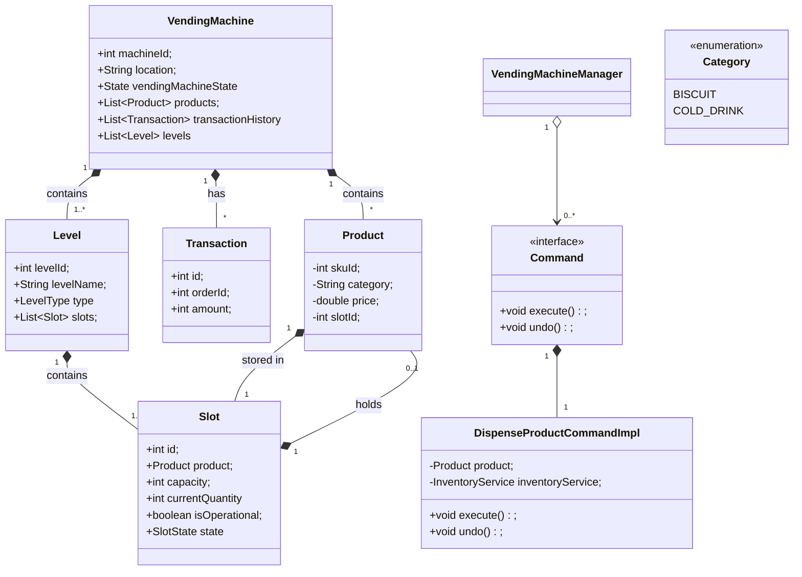

A vending machine system is designed to efficiently manage product inventory, 
handle customer selections, 
process payments,
and dispense products.
The system needs to support multiple product types, manage inventory availability,
handle various payment methods, and provide a seamless purchase experience.
The system should be reliable and capable of handling different machine states and payment strategies.

Rules of the System:
Setup:
• The vending machine has an inventory of products of various types (beverages, snacks, etc.).
• Products have attributes like product ID, name, price, category, and quantity available.
• The system tracks product availability and manages inventory.
Operation:
• Users can browse available products and select items they wish to purchase.
• The vending machine has several states: ready, item selected, payment pending, dispensing, and maintenance.
• The system accepts various payment methods (cash, credit card, mobile payment).
• Once payment is confirmed, the machine dispenses the selected product.
Safety Features:
• The system prevents dispensing when products are out of stock.
• Payment validation ensures secure transactions.
• Audit trails track all purchases and inventory changes.
• Maintenance mode prevents user interaction during servicing.

Point 2: Clarifying Requirements:
Interviewer: We want a system that:
• Supports multiple product types within a single vending machine.
• Handles coin-based payments methods efficiently.
• Manages the state transitions of the vending machine during operations.
Candidate: To summarize, the key requirements are:
• A system with a vending machine containing various product categories.
• State management to handle the flow from product selection to dispensing.
• Coin-based payment implementation to support various payment methods.
• Ability to handle edge cases like out-of-stock items, payment failures, or machine maintenance.Point 2: Clarifying Requirements:
Interviewer: We want a system that:
• Supports multiple product types within a single vending machine.
• Handles coin-based payments methods efficiently.
• Manages the state transitions of the vending machine during operations.
Candidate: To summarize, the key requirements are:
• A system with a vending machine containing various product categories.
• State management to handle the flow from product selection to dispensing.
• Coin-based payment implementation to support various payment methods.
• Ability to handle edge cases like out-of-stock items, payment failures, or machine maintenance.

Entities
    -customer
    -Payment
    -Items/products
    -Inventory
    -Vending mechine

payment service //payment statergy 
    -coin
    -card
    -mobile

Inventory service // observer 
    -stock
    -out of stock
    -Product category
    -stock level
priceing service 
    -price
    -discount
    -tax
    -total price

dispencying service //Command Pattern 
    -dispense product
    -return change
    -return product

Vending Machine Manager //state pattern 
    flow management 

## 🎯 Class Diagram

### **🎯 Key Relationships:**
- **VendingMachine** contains multiple **Levels** and **Products**
- **Level** contains multiple **Slots**
- **Slot** holds one **Product**
- **VendingMachineManager** creates and uses **Commands**
- **Command** interface implemented by **DispenseProductCommandImpl**

### **🎯 Design Patterns Used:**
- **State Pattern**: VendingMachineState for machine states
- **Command Pattern**: Command interface for operations
- **Strategy Pattern**: PaymentService for different payment methods
- **Observer Pattern**: InventoryService for stock notifications 

